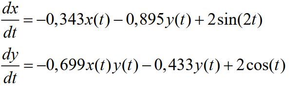
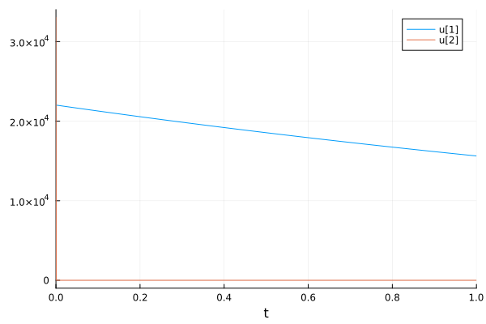

---
## Front matter
lang: ru-RU
title: Лабораторная работа №3
subtitle: Модель боевых действий - Модели Ланчестера
author:
  - Абу Сувейлим Мухаммед Мунивочи
institute:
  - Российский университет дружбы народов, Москва, Россия
date: 24 февраля 2024

## i18n babel
babel-lang: russian
babel-otherlangs: english
mainfont: Arial
monofont: Courier New
fontsize: 12pt

## Formatting pdf
toc: false
toc-title: Содержание
slide_level: 2
aspectratio: 169
section-titles: true
theme: metropolis
header-includes:
 - \metroset{progressbar=frametitle,sectionpage=progressbar,numbering=fraction}
 - '\makeatletter'
 - '\beamer@ignorenonframefalse'
 - '\makeatother'
---

# Задача
### Вариант 36

Между страной X и страной Y идет война. Численность состава войск исчисляется от начала войны, и являются временными функциями x(t) и y(t). В начальный момент времени страна Х имеет армию численностью 22022 человек, а в распоряжении страны У армия численностью в 33 033 человек. Для упрощения модели считаем, что коэффициенты a, b, c, h постоянны Также считаем P(t) и Q(t) непрерывные функции.

## Задача

Постройте графики изменения численности войск армии Х и армии У для следующих случаев:

1. Модель боевых действий между регулярными войсками

## Задача

2. Модель ведение боевых действий с участием регулярных войск и партизанских отрядов

# Выполнение лабораторной работы

## Моделирование на Julia

1. Модель боевых действий между регулярными войсками
   
   

- Армия Y побеждает блягодря большее числонести армии

## Моделирование на Julia

2.  Модель ведение боевых действий с участием регулярных войск и партизанских отрядов

  

- армия Y проеграла даже с большее количество солдатов из-за боейвих действей с пртизанами, а не с регулярной армию.

## Моделирование на OpenModelica

1. Модель боевых действий между регулярными войсками

- Армия Y побеждает блягодря большее числонести армии
  
## Моделирование на OpenModelica

2. Модель ведение боевых действий с участием регулярных войск и партизанских отрядов

- армия Y проеграла даже с большее количество солдатов из-за боейвих действей с пртизанами, а не с регулярной армию.

# Вывод

- В первом случае армия Y побеждает блягодря большее числонести армии. Во втором случае армия Y проеграла даже с большее количество солдатов из-за боейвих действей с пртизанами, а не с регулярной армию.
- В общем моделирвать математические процесии легче и быстрее в OpenModelica чем на Julia

# Библиография

1. Julia 1.10 Documentation // Julia URL: https://docs.julialang.org/en/v1/ (дата обращения: 24.02.2024).
2.  М. П. Осипов: к идентификации личности автора первой модели глобальных процессов. Дата обращения: 22 сентября 2020. Архивировано 29 сентября 2020 года. (из Wikipedia)