# Цель работы

- Целью работы является познокомится с простейшими моделими боевых действий – модели
Ланчестера. 
- Сделать начальный аналих этих модлей.

# Задание

1. Постройте графики изменения численности войск армии Х и армии У для следующих случаев:
   - Модель боевых действий между регулярными войсками;
   - Модель боевых действий между регулярными войсками.
2. Графики должны быть созданы/построенны используя Julia и OpenModelica.

# Теоретическое введение

Законы Ланчестера (законы Осипова — Ланчестера) — математическая формула для расчета относительных сил пары сражающихся сторон — подразделений вооруженных сил. В статье «Влияние численности сражающихся сторон на их потери», опубликованной журналом «Военный сборник» в 1915 году, генерал-майор Корпуса военных топографов М. П. Осипов описал математическую модель глобального вооружённого противостояния, практически применяемую в военном деле при описании убыли сражающихся сторон с течением времени и, входящую в математическую теорию исследования операций, на год опередив английского математика Ф. У. Ланчестера. Мировая война, две революции в России не позволили новой власти заявить в установленном в научной среде порядке об открытии царского офицера.

Уравнения Ланчестера — это дифференциальные уравнения, описывающие зависимость между силами сражающихся сторон A и D как функцию от времени, причем функция зависит только от A и D.

# Выполнение лабораторной работы

## Модель боевых действий между регулярными войсками

### Модлеирование на языке программеровании Julia

1. Во-первых, я использвал пакеты Plots и DifferentialEquations.
   
    

2. Инициализировал нужны нам константи и функции в моделии.
   x0 - численность первой армии x; y0 - численность второй армии y; a - константа, характеризующая степень влияния различных факторов на потери; b - эффективность боевых действий армии у; c - ффективность боевых действий армии х; h - константа, характеризующая степень влияния различных факторов на потери.
   P(t)- возможность подхода подкрепления к армии х; Q(t) - возможность подхода подкрепления к армии y.

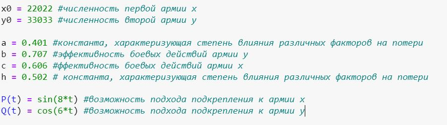

3. Я еше добавил интервал времении от 0 до 1. 
   
   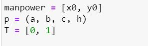

4. Теперь можно построиет модель боевых действий между регулярными войсками №1
   
   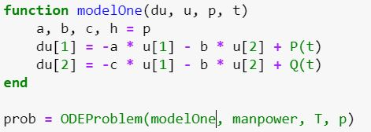

5. Осталось только решить ОДУ.
   
      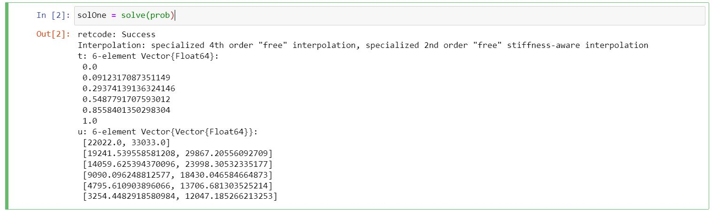

6. График уоказывет числоности армии X и Y. Армия Y побеждает.
   
   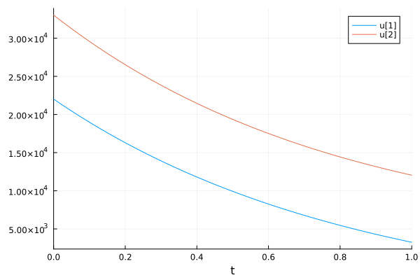

### Модлеирование на языке программеровании OpenModelica

1. В OpenModelica все прощее. Я просто переписал код из Julia. В этой прошраиие все величины имею тот же смысл, что и в Julia.    
   
   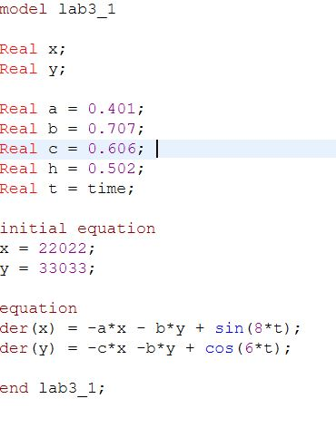

2. График в OpenModelica уоказывет числоности армии X и Y. Армия Y побеждает.
   
    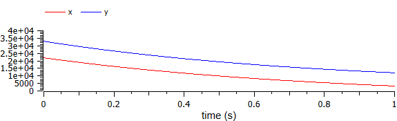

## Модель ведение боевых действий с участием регулярных войск и партизанских отрядов

### Модлеирование на языке программеровании Julia

1. Все то же самое как для первой модели только величены разные и модель то же разнная.
   
    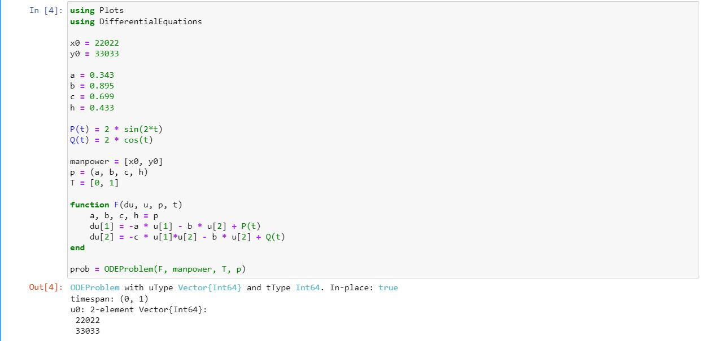

    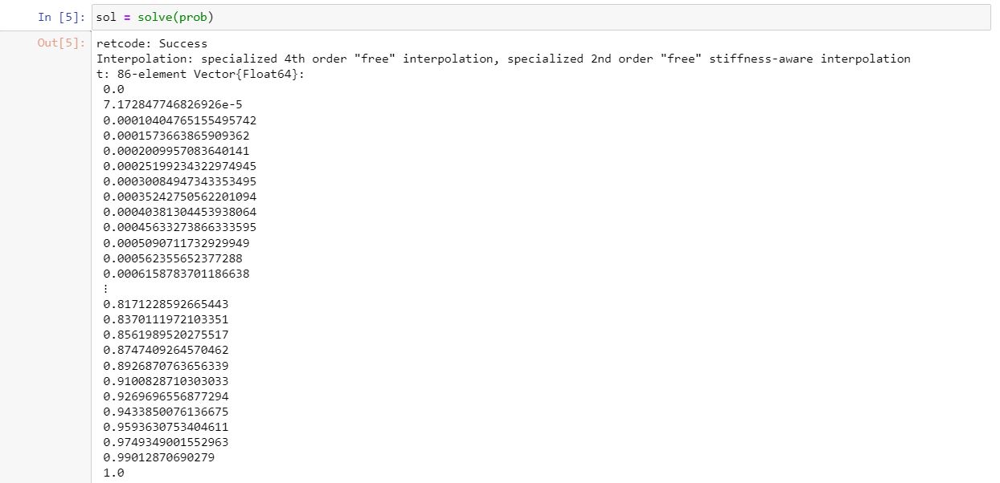

2. График в Julia уоказывет числоности армии X и Y. Армия X побеждает.
   
    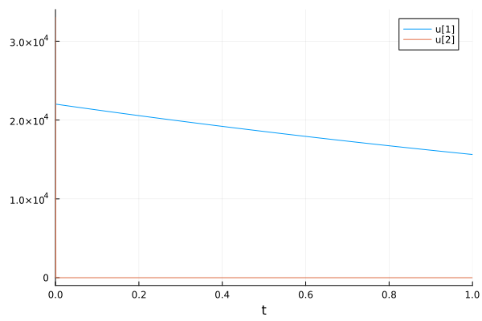

### Модлеирование на языке программеровании OpenModelica

1. Все то же самое как для первой модели только величены разные и модель то же разнная.
   
   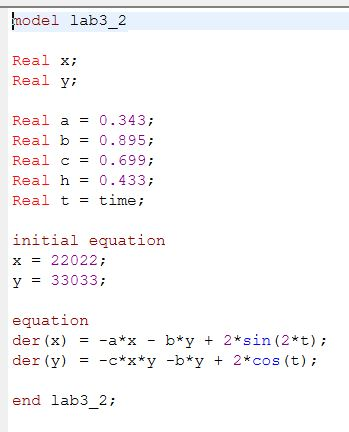

2. График в OpenModelica уоказывет числоности армии X и Y. Армия X побеждает.
   
      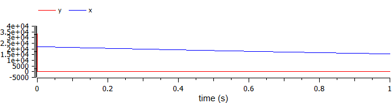

## Исходный код

### Julia

1. Модель боевых действий между регулярными войсками


``` Julia
using Plots
using DifferentialEquations

x0 = 22022 #численность первой армии x
y0 = 33033 #численность второй армии y

a = 0.401 #константа, характеризующая степень влияния различных факторов на потери
b = 0.707 #эффективность боевых действий армии у
c = 0.606 #ффективность боевых действий армии х
h = 0.502 # константа, характеризующая степень влияния различных факторов на потери

P(t) = sin(8*t) #возможность подхода подкрепления к армии х
Q(t) = cos(6*t) #возможность подхода подкрепления к армии y

manpower = [x0, y0]
p = (a, b, c, h)
T = [0, 1] #итервал временни

function modelOne(du, u, p, t)
    a, b, c, h = p
    du[1] = -a * u[1] - b * u[2] + P(t) 
    du[2] = -c * u[1] - b * u[2] + Q(t)
end

prob = ODEProblem(modelOne, manpower, T, p)
solOne = solve(prob)
plot(solOne)
```

2. Модель ведение боевых действий с участием регулярных войск и партизанских отрядов

``` Julia
using Plots
using DifferentialEquations

x0 = 22022
y0 = 33033

a = 0.343 
b = 0.895 
c = 0.699 
h = 0.433

P(t) = 2 * sin(2*t)
Q(t) = 2 * cos(t)

manpower = [x0, y0]
p = (a, b, c, h)
T = [0, 1]

function F(du, u, p, t)
    a, b, c, h = p
    du[1] = -a * u[1] - b * u[2] + P(t) 
    du[2] = -c * u[1]*u[2] - b * u[2] + Q(t)
end

prob = ODEProblem(F, manpower, T, p)
sol = solve(prob)
plot(sol)
```

### OpenModelica

1. Модель боевых действий между регулярными войсками

``` OpenModelica
model lab3_1

Real x; 
Real y; 

Real a = 0.401; 
Real b = 0.707; 
Real c = 0.606; 
Real h = 0.502;
Real t = time;

initial equation
x = 22022;
y = 33033;

equation
der(x) = -a*x - b*y + sin(8*t);
der(y) = -c*x -b*y + cos(6*t);

end lab3_1;
```

2. Модель ведение боевых действий с участием регулярных войск и партизанских отрядов

``` OpenModelica
model lab3_2

Real x; 
Real y; 

Real a = 0.343; 
Real b = 0.895; 
Real c = 0.699; 
Real h = 0.433;
Real t = time;

initial equation
x = 22022;
y = 33033;

equation
der(x) = -a*x - b*y + 2*sin(2*t);
der(y) = -c*x*y -b*y + 2*cos(t);

end lab3_2;
```

# Вывод

- В первом случае армия Y побеждает блягодря большее числонести армии. Во втором случае армия Y проеграла даже с большее количество солдатов из-за боейвих действей с пртизанами, а не с регулярной армию.
- В общем моделирвать математические процесии легче и быстрее в OpenModelica чем на Julia


# Библиография

1. Julia 1.10 Documentation // Julia URL: https://docs.julialang.org/en/v1/ (дата обращения: 24.02.2024).
2.  М. П. Осипов: к идентификации личности автора первой модели глобальных процессов. Дата обращения: 22 сентября 2020. Архивировано 29 сентября 2020 года. (из Wikipedia)