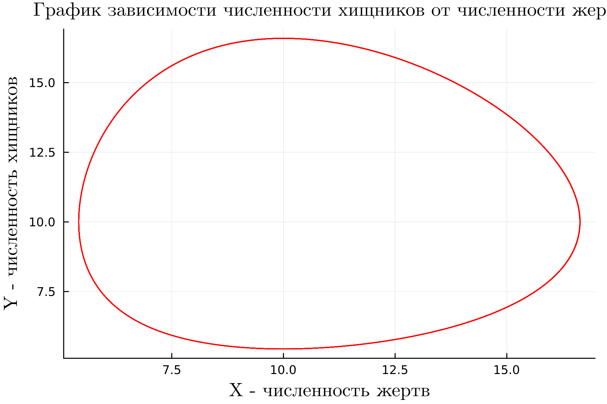

---
## Front matter
lang: ru-RU
title: Лабораторная работа №5
subtitle: Модель Лотки-Вольтерры
author:
  - Абу Сувейлим Мухаммед Мунивочи
institute:
  - Российский университет дружбы народов, Москва, Россия
date: 9 марта 2024

## i18n babel
babel-lang: russian
babel-otherlangs: english
##mainfont: Arial
##monofont: Courier New
##fontsize: 8pt

## Formatting pdf
toc: false
toc-title: Содержание
slide_level: 2
aspectratio: 169
section-titles: true
theme: metropolis
header-includes:
 - \metroset{progressbar=frametitle,sectionpage=progressbar,numbering=fraction}
 - '\makeatletter'
 - '\beamer@ignorenonframefalse'
 - '\makeatother'
---

# Информация

## Докладчик

::::::::::::::: {.columns align=center}
::: {.column width="70%"}

  * Абу Сувейлим Мухаммед Мунифович
  * студент, НКНбд-01-21
  * Российский университет дружбы народов
  * [103221315@pfur.ru](mailto:103221315@pfur.ru)
:::
::: {.column width="30%"}

:::
::::::::::::::

# Вводная часть

## Актуальность

- Классический подход к описанию динамики популяций опирается на дифференциальные уравнения Лотки-Вольтерра и их различные модификации.
- Модель Лотки Вольтерры принимается в таких областях, как экономика и маркетинг.

## Объект и предмет исследования

- Объектом и предметом исследования является модель хищник-жертва, именно модель Лотки-Вольтерры, как модель взаимодействий двух видов типа «хищник — жертва».

## Цели и задачи

- Вариант 36: Для модели «хищник-жертва»:
   $$
   \begin{cases}    
   \frac{dx}{dt} = ax(t) - bx(t)y(t)\\
   \frac{dy}{dt} = -cx(t) + dx(t)y(t) 
   \end{cases}
   $$
   Постройте график зависимости численности хищников от численности жертв,
   а также графики изменения численности хищников и численности жертв при
   следующих начальных условиях: $x_0 = 8$, $y_0 = 16$. Найдите стационарное
   состояние системы.
## Цели и задачи

- Описать код программы на Julia и OpenModelica

## Материалы и методы

- Одум, Ю. *Основ экологии*. Москва: Мир, 1986. 376 с.

- Турчин, П. В. *Лекция №14. Популяционная динамика*. Москва: Биологическое образование в МФТИ, 2012.

- Прасолов, А. *Some Quantitative Methods and Models in Economic Theory*. 2016.

- Перцев, Н. В., Перцева, А. Н. "Интегральная модель Лотки-Вольтерра и некоторые свойства ее решений." *Математические структуры и моделирование*, 2000, № 1 (5), с. 72-81.

- [Julia Documentation](https://docs.julialang.org/en/v1/). (дата обращения: 09.03.2024)


# Моделирование на Julia и OpenModelica 

## Реализация на Julia 

```Julia
a = 0.83 #коэффициент естественной смертности хищников
b = 0.083 #коэффициент естественного прироста жертв
c = 0.82  #коэффициент увеличения числа хищников
d = 0.082 #коэффициент смертности жертв
x0 = 8 #начальное число жертв
y0 = 16 #начальное число хищников
```
## Реализация на Julia 

```Julia
#система дифф уравнений 1-го порядка для модели Лотки-Вольтерры
function modelLotkaVolterra(du, u, p, t)
    x, y = u
    du[1] = a*u[1] -b*u[1]*u[2]
    du[2] = -c*u[2] + d*u[1]*u[2]
end
```
## Реализация на Julia 

```Julia
#система дифф уравнений 1-го порядка для модели Лотки-Вольтерры
prob = ODEProblem(modelLotkaVolterra, u0, tspan)
sol = solve(prob, dtmax = 0.05)
```
## Реализация на Julia 
- Когда начальные значения находятся в стационарном состоянии.

```Julia
a = 0.83 #коэффициент естественной смертности хищников
b = 0.083 #коэффициент естественного прироста жертв
c = 0.82  #коэффициент увеличения числа хищников
d = 0.082 #коэффициент смертности жертв
x0 = c/d #начальное число жертв
y0 = a/b #начальное число хищников
```

## Реализация в OpenModelica 

```OpenModelica
model lab5_1

Real x;
Real y;
Real a = 0.83;
Real b = 0.083;
Real c = 0.82;
Real d = 0.082;

Real t = time;
```
## Реализация в OpenModelica 

```OpenModelica
initial equation

x = 8;
y = 16;
```
## Реализация в OpenModelica 

```OpenModelica
equation

der(x) = a*x - b*x*y;
der(y) = -c*y + d*x*y;

end lab5_1;
```

## Реализация в OpenModelica 

- Когда начальные значения находятся в стационарном состоянии.

```OpenModelica
initial equation

x = c / d;
y = a / b;
```

# Результаты 

## График зависимости численности хищников от численности жертв

- Полученный график на Julia.

{#fig:001 width=50%}


## Графики изменения численности хищников и численности жертв при заданных  начальных условиях

- Полученный график в OpenModelica, когда коэффициенты $a, b, c, d$ отрицательные.

{#fig:002 width=50%}

## Графики изменения численности хищников и численности жертв при заданных  начальных условиях

- Полученный график на Julia, когда коэффициенты $a, b, c, d$ положительные.

{#fig:003 width=50%}

## Стационарное состояние системы

- Полученный график на Julia.
  
{#fig:004 width=50%}


## Вывод

- Жесткую модель всегда надлежит исследовать на структурную устойчивость полученных при ее изучении результатов по отношению к малым изменениям модели (делающим ее мягкой).
- Если начальные значения задать в стационарном состоянии $x(0) = x_0$ и $y(0) = y_0$, то в любой момент времени численность популяций изменяться не будет 
