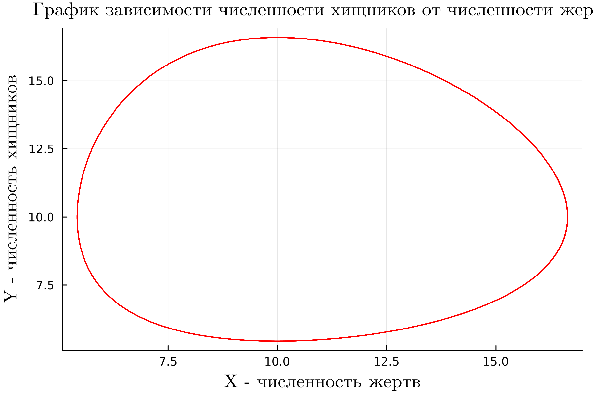
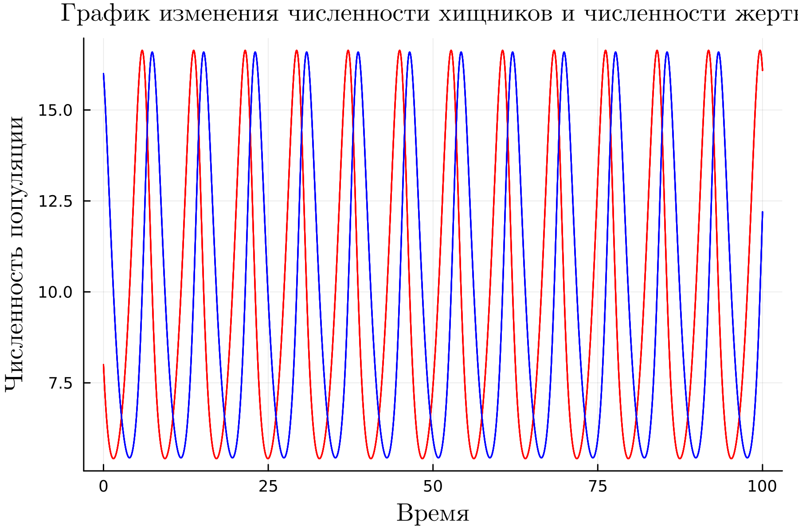
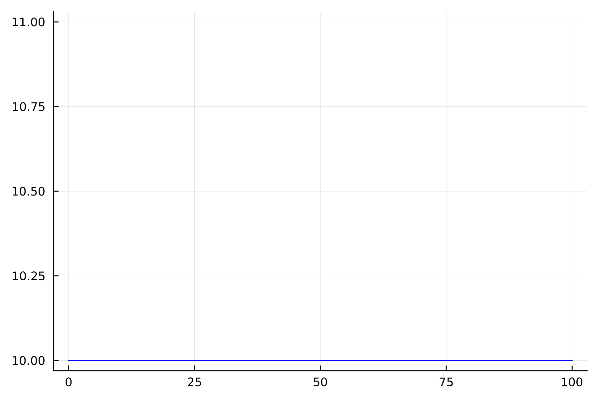
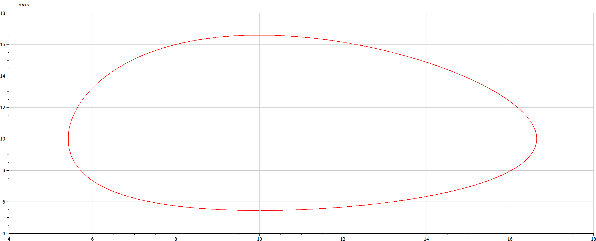
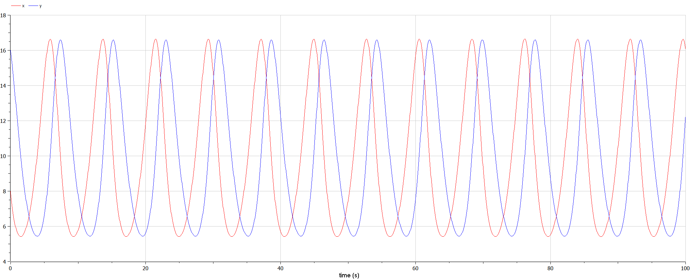
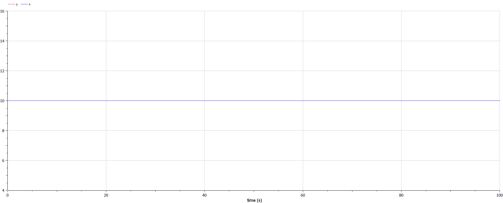

# Цель работы

- Целью работы является познокомится с моделью хищник-жертва.

# Задание

1. Постройте график зависимости численности хищников от численности жертв;
2. графики изменения численности хищников и численности жертв при следующих начальных условиях: $x_0 = 8, y_0 = 16$;
3. найти стационарноесостояние системы.


# Теоретическое введение

Модель Лотки — Вольтерры (модель Лотки — Вольтерра) [@Turchin] — модель взаимодействия двух видов типа «хищник — жертва», названная в честь своих авторов (Лотка, 1925; Вольтерра 1926), которые предложили модельные уравнения независимо друг от друга.

Такие уравнения можно использовать для моделирования систем «хищник — жертва», «паразит — хозяин», конкуренции и других видов взаимодействия между двумя видами [@Odum].

В математической форме предложенная система имеет следующий вид:

$\frac{dx}{dt} = ax(t) - bx(t)y(t)$

$\frac{dy}{dt} = -cx(t) + dx(t)y(t)$

В этой модели $x$ – число жертв, $y$ - число хищников. Коэффициент a
описывает скорость естественного прироста числа жертв в отсутствие хищников, с естественное вымирание хищников, лишенных пищи в виде жертв. Вероятность взаимодействия жертвы и хищника считается пропорциональной как количеству жертв, так и числу самих хищников ($xy$). Каждый акт взаимодействия уменьшает популяцию жертв, но способствует увеличению популяции хищников (члены $-bxy$ и $dxy$ в правой части уравнения).


# Выполнение лабораторной работы

## Моделирование на языке программировании  Julia

### Построение графика зависимости численности хищников от численности жертв

1. Во-первых, я использвал пакеты Plots и DifferentialEquations для постпроения графиков и для решения дифференциальных уравнений, соответственно.

   ```Julia
   using Plots
   using DifferentialEquations
   ```

2. Инициализировал нужны нам константи и функции в моделии. $a= 0.83$ - это коэффициент естественной смертности хищников; $b= 0.083$ - это коэффициент естественного прироста жертв $c= 0.82$  - это коэффициент увеличения числа хищников
$d= 0.082$ - это коэффициент смертности жертв $x_0 = 8$ - это начальное число жертв
$y_0 = 16$ - это начальное число хищников

   ```Julia
    #начальные значения

    a= 0.83 #коэффициент естественной смертности хищников
    b= 0.083#коэффициент естественного прироста жертв
    c= 0.82  #коэффициент увеличения числа хищников
    d= 0.082 #коэффициент смертности жертв
    x0 = 8 #начальное число жертв
    y0 = 16 #начальное число хищников
        #система дифф уравнений 1-го порядка для модели Лотки-Вольтерры

    function modelLotkaVolterra(du, u, p, t)
        x, y = u
        du[1] = a*u[1] -b*u[1]*u[2]
        du[2] = -c*u[2] + d*u[1]*u[2]
    end
   ```

3. Далее я обозначал мнтервал времени.

   ```Julia
   tspan = (0, 100) #произвольный интервал временни
   ```

4. Здесь я дал аргументы для функции ODEProblem которая указывает на дифф уравнение. Далее, я уравнение решил. Шан времени = $0.05$

   ```Julia
    prob = ODEProblem(modelLotkaVolterra, u0, tspan)
    sol = solve(prob, dtmax = 0.05)
   ```


6. Здесь я переименавал названия переменных.

   ```Julia
    X = [u[1] for u in sol.u]
    Y = [u[2] for u in sol.u]
    Time = [t for t in sol.t]
   ```

7. Далее я подготовил пространство для первого графика.

   ```Julia
   pltOne = plot(dpi = 300, legend = false)
   ```

8. Наконец, я построил график зависимости численности хищников от численности жертв.

   ```Julia
   plot!(
    pltOne, 
    X, 
    Y, 
    title = "График зависимости численности хищников от численности жертв",
    titlefont = font(12,"Computer Modern"),
    xlabel = "X - численность жертв",
    ylabel = "Y - численность хищников",
    xtickfontsize=8,
    xguidefontsize=12,
    xguidefont = "Computer Modern",
    ytickfontsize=8,
    yguidefontsize=12,
    yguidefont = "Computer Modern",
    color=:red)
   ```

9. Получуный график.

   {#fig:001 width=70%}

10. Далее я подготовил пространство для второго графика.

```Julia
   pltTwo = plot(dpi = 300, legend = false) 
```
11. Я построил график изменения численности хищников и численности жертв при
заданый начальных условиях.

{#fig:002 width=70%}

12. Для назождения стационарное состояние системы нужно чтобы начадьное точка была в координатах $x_0 = \frac{c}{d}$, $y_0 = \frac{a}{b}$.

```Julia
        #начальные значения

    a= 0.83 #коэффициент естественной смертности хищников
    b= 0.083#коэффициент естественного прироста жертв
    c= 0.82  #коэффициент увеличения числа хищников
    d= 0.082 #коэффициент смертности жертв
    x0 = c / d #начальное число жертв
    y0 = a / b#начальное число хищников
   ```
13. Все остальное как и было.

14. Получаем следующий график, где у нас численность популяций не меняется никогда. Также получилось что у нас численность популяций хищников и жертв одинаковые.

{#fig:003 width=70%}


## Моделирование на языке программировании OpenModelica

1. В OpenModelica все прощее. Я просто переписал код из Julia. В этой программе все величины имею тот же смысл, что и в Julia. Переменая t указывает на время.

   ```OpenModelica
    model lab5_1

    Real x;
    Real y;
    Real a = 0.83;
    Real b = 0.083;
    Real c = 0.82;
    Real d = 0.082;

    Real t = time;

    initial equation

    x = 8;
    y = 16;

    equation

    der(x) = -a*x + b*x*y;
    der(y) = c*y-b*x*y;

    end lab5_1;
   ```

2. График зависимости численности хищников от численности жертв в OpenModelica.

   {#fig:004 width=70%}

3. График изменения численности хищников и численности жертв при заданый начальных условиях в OpenModelica

   {#fig:005 width=70%}

4. Как и в Julia, для назождения стационарное состояние системы нужно чтобы начадьное точка была в координатах $x_0 = \frac{c}{d}$, $y_0 = \frac{a}{b}$.

{#fig:006 width=70%}

## Исходный код

### Julia

1. Код в случае график зависимости численности хищников от численности жертв, а также графики изменения численности хищников и численности жертв при заданых начальных условиях на Julia

   ``` Julia
    using Plots
    using DifferentialEquations

    #Вариант 36
    1032215135%70 + 1

    #начальные значения

    a= 0.83 #коэффициент естественной смертности хищников
    b= 0.083#коэффициент естественного прироста жертв
    c= 0.82  #коэффициент увеличения числа хищников
    d= 0.082 #коэффициент смертности жертв
    x0 = 8 #начальное число жертв
    y0 = 16 #начальное число хищников

    #система дифф уравнений 1-го порядка для модели Лотки-Вольтерры

    function modelLotkaVolterra(du, u, p, t)
        x, y = u
        du[1] = a*u[1] -b*u[1]*u[2]
        du[2] = -c*u[2] + d*u[1]*u[2]
    end

    u0 = [x0, y0]

    tspan = (0, 100) #произвольный интервал временни

    prob = ODEProblem(modelLotkaVolterra, u0, tspan)

    sol = solve(prob, dtmax = 0.05)

    X = [u[1] for u in sol.u]
    Y = [u[2] for u in sol.u]
    Time = [t for t in sol.t]

    pltOne = plot(dpi = 300, legend = false)

    plot!(
        pltOne, 
        X, 
        Y, 
        title = "График зависимости численности хищников от численности жертв",
        titlefont = font(12,"Computer Modern"),
        xlabel = "X - численность жертв",
        ylabel = "Y - численность хищников",
        xtickfontsize=8,
        xguidefontsize=12,
        xguidefont = "Computer Modern",
        ytickfontsize=8,
        yguidefontsize=12,
        yguidefont = "Computer Modern",
        color=:red)

    savefig(pltOne, "lab5_1.png")

    pltTwo = plot(dpi = 300, legend = false,  label = ["Численность жертв" "Численность хищников"]) 

    plot!(
        pltTwo, 
        Time, 
        X,
        label = ["Численность жертв"],
        title = "График изменения численности хищников и численности жертв",
        titlefont = font(8,"Computer Modern"),
        xlabel = "Время",
        ylabel = "Численность популяции",
        xtickfontsize=8,
        xguidefontsize=12,
        xguidefont = "Computer Modern",
        ytickfontsize=8,
        yguidefontsize=12,
        yguidefont = "Computer Modern",
        color=:red)
    plot!(
        pltTwo, 
        Time, 
        Y,
        label = ["Численность хищников"],
        title = "График изменения численности хищников и численности жертв",
        titlefont = font(12,"Computer Modern"),
        xlabel = "Время",
        ylabel = "Численность популяции",
        xtickfontsize=8,
        xguidefontsize=12,
        xguidefont = "Computer Modern",
        ytickfontsize=8,
        yguidefontsize=12,
        yguidefont = "Computer Modern",
        color=:blue)
   ```
2. Код стационарное состояние системы на Julia.

```Julia
using Plots
using DifferentialEquations

#начальные значения

a= 0.83 #коэффициент естественной смертности хищников
b= 0.083#коэффициент естественного прироста жертв
c= 0.82  #коэффициент увеличения числа хищников
d= 0.082 #коэффициент смертности жертв
x0 = c / d #начальное число жертв
y0 = a / b#начальное число хищников

#система дифф уравнений 1-го порядка для модели Лотки-Вольтерры

function stationaryModelLotkaVolterra(du, u, p, t)
    x, y = u
    du[1] = a*u[1] -b*u[1]*u[2]
    du[2] = -c*u[2] + d*u[1]*u[2]
end

u0 = [x0, y0]

tspan = (0, 100) #произвольный интервал временни

prob = ODEProblem(stationaryModelLotkaVolterra, u0, tspan)

sol = solve(prob, dtmax = 0.05)

X = [u[1] for u in sol.u]
Y = [u[2] for u in sol.u]
Time = [t for t in sol.t]

pltTwo = plot(dpi = 300, legend = false) 

plot!(
    pltTwo, 
    Time, 
    X,
    label = "Численность жертв",
    color=:red)
plot!(
    pltTwo, 
    Time, 
    Y,
    label = "Численность хищников",
    color=:blue)

savefig(pltTwo, "lab5_2_2")
```


### OpenModelica

1. Код в случае график зависимости численности хищников от численности жертв, а также графики изменения численности хищников и численности жертв при заданых начальных условиях в OpenModelica

   ``` OpenModelica
   model lab5_1

    Real x;
    Real y;
    Real a = 0.83;
    Real b = 0.083;
    Real c = 0.82;
    Real d = 0.082;

    Real t = time;

    initial equation

    x = 8;
    y = 16;

    equation

    der(x) = -a*x + b*x*y;
    der(y) = c*y-b*x*y;

    end lab5_1;
   ```

2. Код стационарное состояние системы в OpenModelica

   ``` OpenModelica
   model lab5_2

    Real x;
    Real y;
    Real a = 0.83;
    Real b = 0.083;
    Real c = 0.82;
    Real d = 0.082;

    initial equation

    x = c / d;
    y = a / b;

    equation

    der(x) = a*x - b*x*y;
    der(y) = -c*y+d*x*y;

    end lab5_2;
   ```

# Вывод

- Жесткую модель всегда надлежит исследовать на структурную устойчивость полученных при ее изучении результатов по отношению к малым изменениям модели (делающим ее мягкой).
- Если начальные значения задать в стационарном состоянии $x(0) = x_0$ и $y(0) = y_0$, то в любой момент времени численность популяций изменяться не будет 

# Библиография

::: {#refs}
:::