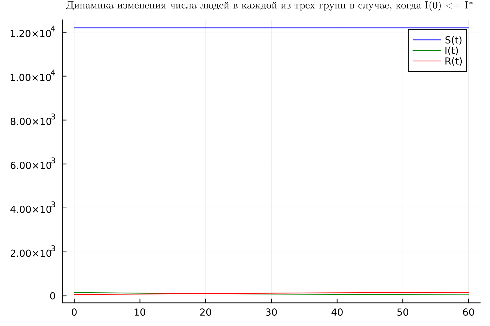
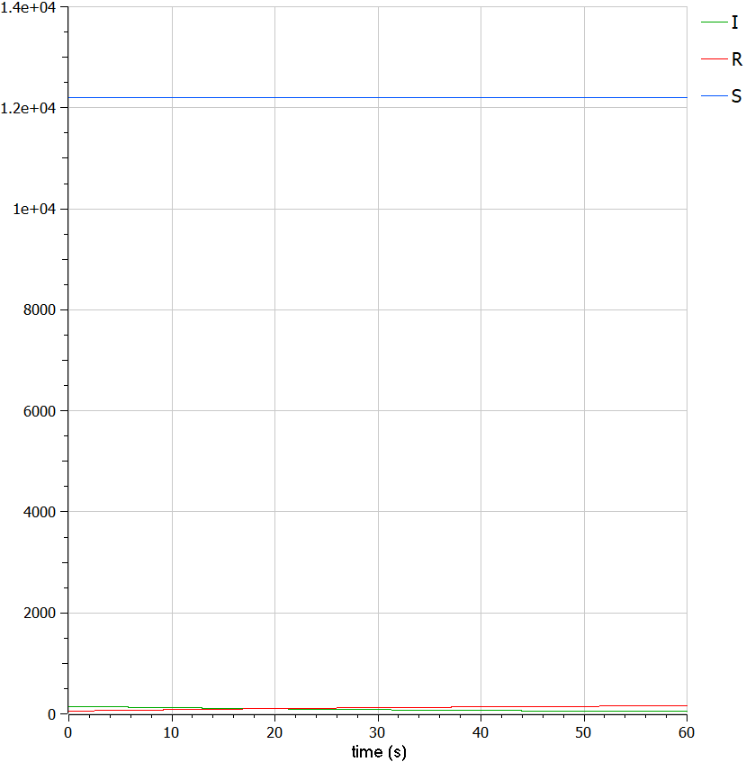
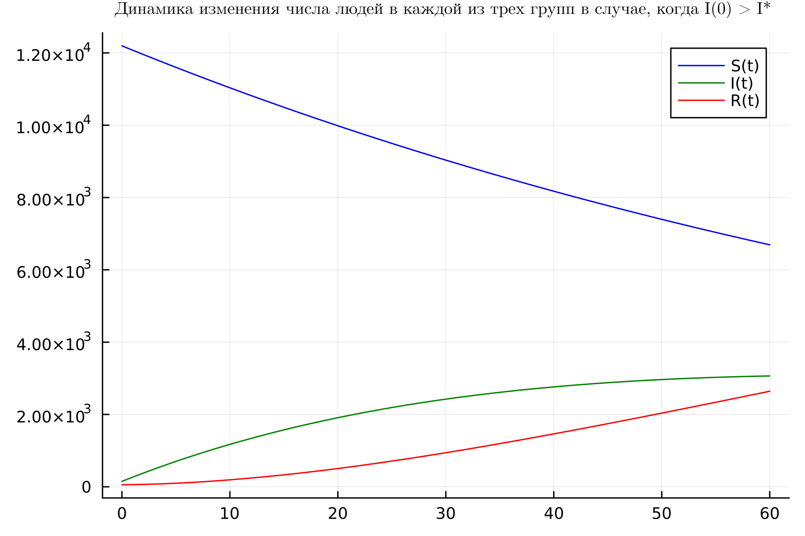
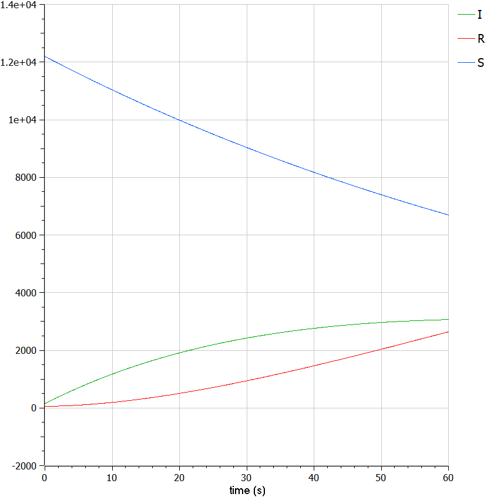
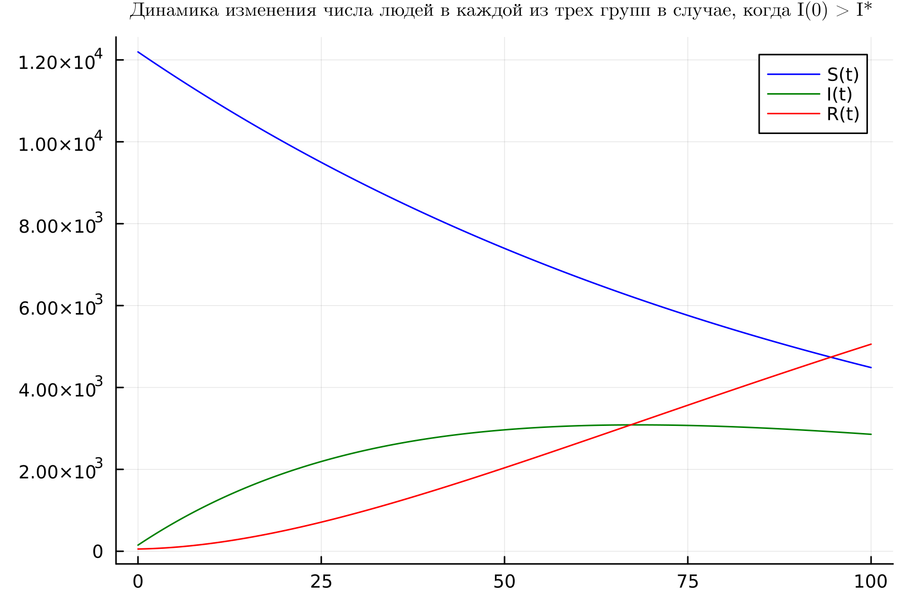

---
## Front matter
lang: ru-RU
title: Лабораторная работа №6
subtitle: Задача об эпидемии
author:
  - Абу Сувейлим Мухаммед Мунивочи
institute:
  - Российский университет дружбы народов, Москва, Россия
date: 16 марта 2024

## i18n babel
babel-lang: russian
babel-otherlangs: english
##mainfont: Arial
##monofont: Courier New
##fontsize: 8pt

## Formatting pdf
toc: false
toc-title: Содержание
slide_level: 2
aspectratio: 169
section-titles: true
theme: metropolis
header-includes:
 - \metroset{progressbar=frametitle,sectionpage=progressbar,numbering=fraction}
 - '\makeatletter'
 - '\beamer@ignorenonframefalse'
 - '\makeatother'
---

# Информация

## Докладчик

::::::::::::::: {.columns align=center}
::: {.column width="70%"}

  * Абу Сувейлим Мухаммед Мунифович
  * студент, НКНбд-01-21
  * Российский университет дружбы народов
  * [103221315@pfur.ru](mailto:103221315@pfur.ru)
:::
::: {.column width="30%"}

:::
::::::::::::::

# Вводная часть

## Актуальность

- Модель SIR была недавно использована для прогнозирования пандемии COVID-19.

## Объект и предмет исследования

- Объектом и предметом исследования является Задача об эпидемии, именно модель SIR, как модель  распространения инфекционных заболеваний.

## Цели и задачи

1. Целью работы является познокомится с простейшую модель эпидемии и проанализировать её.

2. Построить графики изменения числа особей в каждой из трех групп S, I и R в случае;
   - если $I(0) \leqslant I^*$;
   - если $I(0) > I^*$.

3. Описать код программы на Julia и OpenModelica

## Материалы и методы

- Жумартова Б.О., Ысмагул Р.С. ПРИМЕНЕНИЕ SIR МОДЕЛИ В МОДЕЛИРОВАНИИ ЭПИДЕМИЙ // Международный журнал гуманитарных и естественных наук. 2021. №12-2.

- Денисова Юлия Сергеевна Цепочки распространения эпидемиологических процессов в разных странах: дис. ПМИ наук: 01.04.02. - СПБ., 2023. - 88 с.

- [Julia Documentation](https://docs.julialang.org/en/v1/). (дата обращения: 16.03.2024)

# Теоретическое введение

## Модель SIR

- Наиболее распространенной эпидемиологической моделью является модель SIR, разработанная Россом, Хеймером и другими исследователями в начале двадцатого века, состоящая из
системы трех связанных нелинейных обыкновенных дифференциальных уравнений.

## Модель SIR

- В модели SIR люди делятся на три типа:
  - Восприимчивые (Susceptible): это агенты, которые являются
  восприимчивыми к инфекции, то есть те, кто может заболеть; также
  сюда могут входить пассивно невосприимчивые, как только они теряют
  иммунитет.
  - Инфицированные (Infected): это агенты, у которых высокая вероятность
  передачи инфекции другим восприимчивым агентам;
  - Выздоровевший или выбывший (Recovered/Resistant): включает агентов,
  которые были инфицированы и выздоровели, либо умерли.

## Модель SIR

. Скорость изменения числа $S(t)$ меняется по следующему
закону:

$$
\frac{dS}{dt} =
\begin{cases}
\alpha S, \text{ если I(t) > I*} \\
0, \text{ если I(t) <= I*}
\end{cases}
$$ 

2. Скорость изменения числа инфекционных особей

$$
\frac{dI}{dt} =
\begin{cases}
\alpha S - \beta I, \text{ если I(t) > I*} \\
- \beta I, \text{ если I(t) <= I*}
\end{cases}
$$ 

3. Скорость изменения выздоравливающих особей

$$\frac{dR}{dt} = \beta I$$

# Моделирование на Julia

## Реализация на Julia 

```Julia
#начальные значения
alpha = 0.01 #коэффициент заболеваемости
beta = 0.02 #коэффициент выздоровления
N = 12400 #общая численность популяции
I0 = 150 #количество инфицированных особей в начальный момент времени
R0 = 55 #количество здоровых особей с иммунитетом в начальный момент времени
S0 = N - I0 - R0 #количество восприимчивых к болезни особей в начальный момент времени
```
## Реализация на Julia 

```Julia
#случай, когда I(0)<=I*
  function caseOne(du, u, p, t)
    S, I, R = u
    du[1] = 0
    du[2] = -beta * u[2]
    du[3] = beta * u[2]
  end
```
## Реализация на Julia 

```Julia
#интервал временни и начальные значения
tspan = (0, 60) 
u0 = [S0, I0, R0]
```

## Реализация на Julia 

```Julia
#интервал временни и начальные значения
tspan = (0, 100) 
u0 = [S0, I0, R0]
```

## Реализация на Julia 

```Julia
prob = ODEProblem(caseOne, u0, tspan)
sol = solve(prob, dtmax = 0.05)
```

# Результаты 

## Динамика изменения числа людей в каждой из трех групп в случае, когда I(t) <= I*

- Получуный график если $I(0) \leqslant I^*$ на Julia.

{#fig:001 width=50%}

## Динамика изменения числа людей в каждой из трех групп в случае, когда I(t) <= I*

- Получуный график если $I(0) \leqslant I^*$ в OpenModelica.

{#fig:002 width=50%}

## Динамика изменения числа людей в каждой из трех групп в случае, когда I(t) > I*

- Получуный график если $I(0) > I^*$ на Julia. Интервал временни от 0 до 60.

{#fig:003 width=50%}

## Динамика изменения числа людей в каждой из трех групп в случае, когда I(t) > I*

- Получуный график если $I(0) > I^*$ в OpenModelica. Интервал временни от 0 до 60.

{#fig:004 width=50%}

## Динамика изменения числа людей в каждой из трех групп в случае, когда I(t) > I*

- Получуный график если $I(0) > I^*$ на Julia. Интервал временни от 0 до 100.

{#fig:005 width=50%}

## Вывод

- Мы видим, что количество восприимчивых $S$ со времен уменьшается, число переболевших увеличивается $R$, а число зараженных $I$ также увеличивается, но темп роста уменьшается.
- Один из минусов модели SIR - вероятность вакцинации населения не рассматривается.
