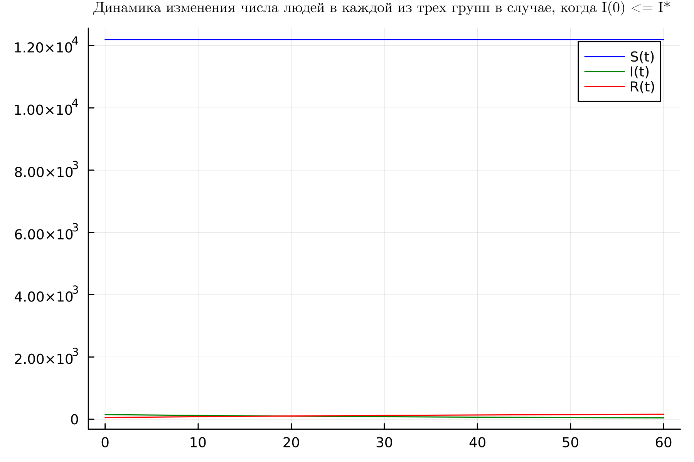
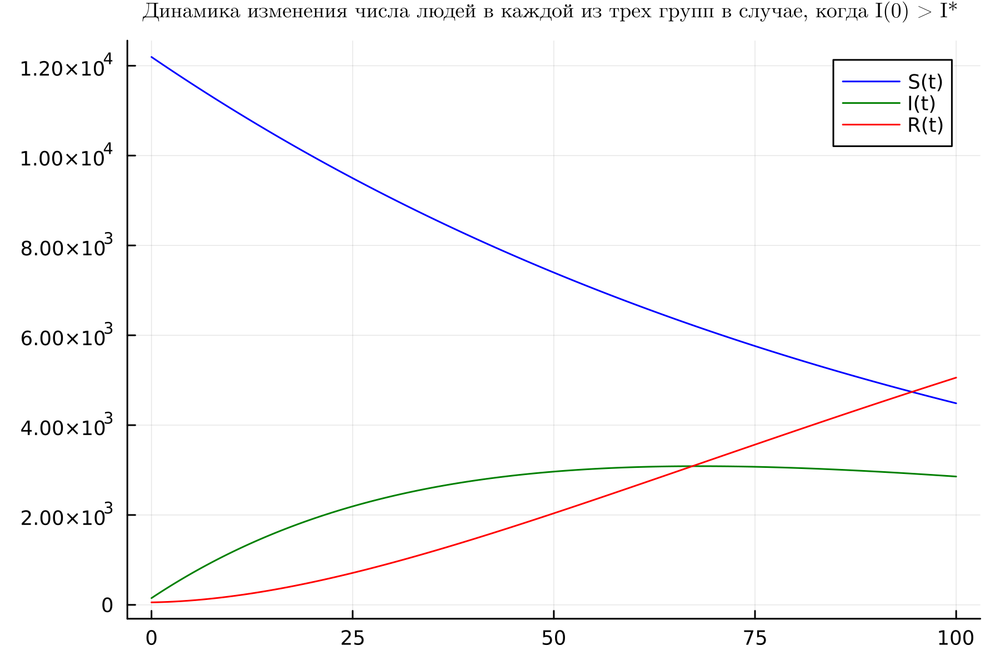
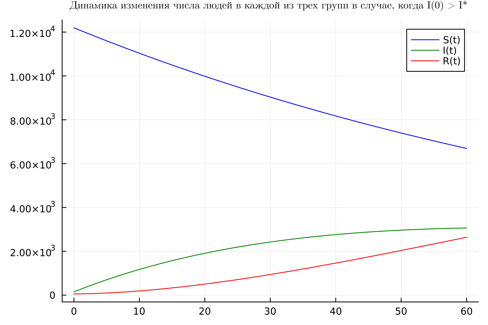
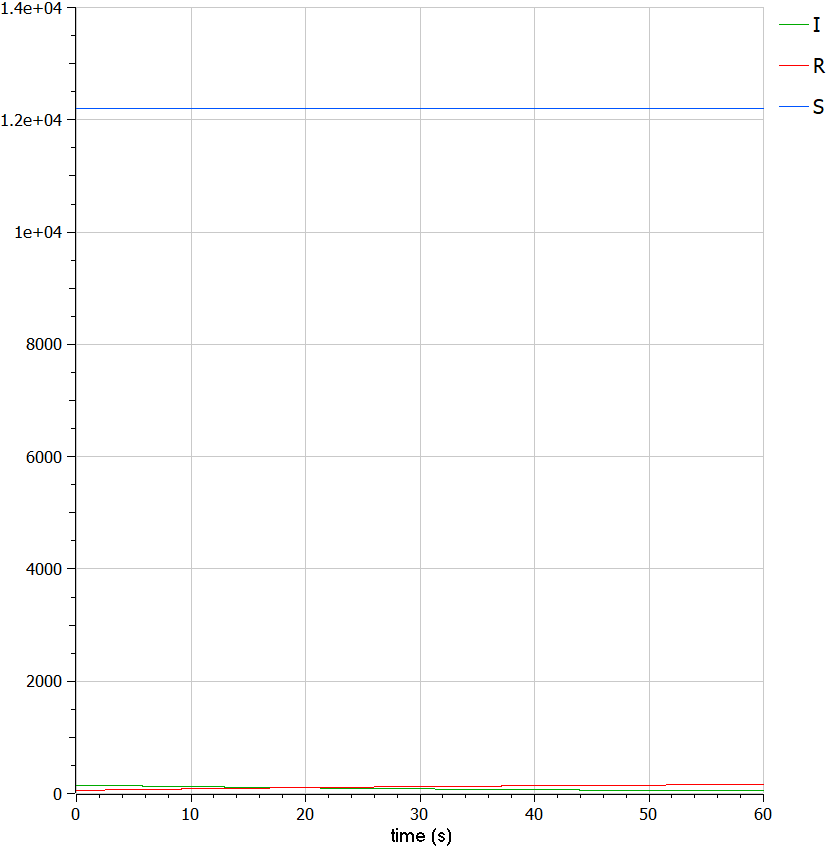
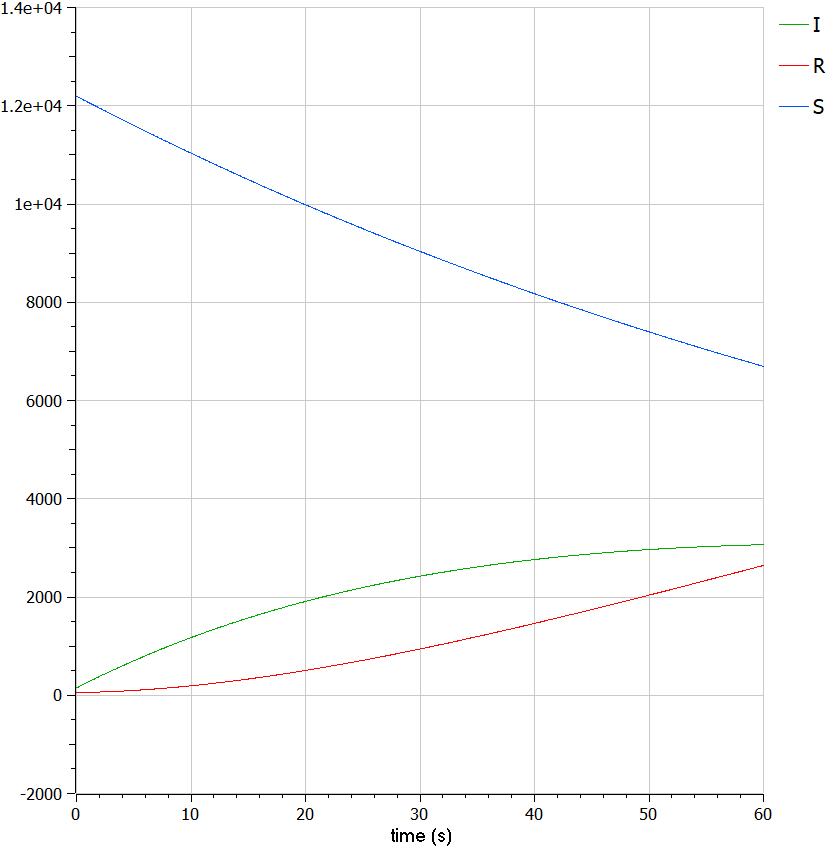

# Цель работы

- Целью работы является познокомится с простейшую модель эпидемии и проанализировать её.

# Задание

1. Построить графики изменения числа особей в каждой из трех групп S, I и R в случае;
   - если $I(0) \leqslant I^*$;
   - если $I(0) > I^*$.


# Теоретическое введение

Модель SIR (модель Кермака Маккедрика) – одна из простейших компартментных моделей, в которых с помощью систем дифференциальных уравнений описывается динамика групп восприимчивых, инфицированных и выздоровевших индивидов. Многие модели являются производными от этой базовой формы. Модель состоит из трех «ячеек». S: количество лиц, восприимчивые к инфекции, то есть, те люди, которые не имеют иммунитета к данному вирусу и потенциально могут заразиться. I: число инфицированных в некоторый момент времени. Это инфицированные люди, способные заразить восприимчивых людей. R: количество людей, которые переболели, имеют иммунитет, или число умерших лиц [@Zhumartova].


1. Скорость изменения числа $S(t)$ меняется по следующему
закону:

$$
\frac{dS}{dt} =
\begin{cases}
\alpha S, \text{ если I(t) > I*} \\
0, \text{ если I(t) <= I*}
\end{cases}
$$ 

2. Скорость изменения числа инфекционных особей

$$
\frac{dI}{dt} =
\begin{cases}
\alpha S - \beta I, \text{ если I(t) > I*} \\
- \beta I, \text{ если I(t) <= I*}
\end{cases}
$$ 

3. Скорость изменения выздоравливающих особей

$$\frac{dR}{dt} = \beta I$$

# Выполнение лабораторной работы

## Моделирование на языке программировании  Julia

### если $I(0) \leqslant I^*$

1. Во-первых, я использвал пакеты Plots и DifferentialEquations для постпроения графиков и для решения дифференциальных уравнений, соответственно.

   ```Julia
   using Plots
   using DifferentialEquations
   ```

2. Инициализировал нужны нам константи и функции в моделии. $\alpha = 0.01$ - это коэффициент заболеваемости; $\beta = 0.02$ - это коэффициент выздоровления; $N = 124002$  - это общая численность популяции; $I_0 = 150$ - это количество инфицированных особей в начальный момент времени; $R_0 = 55$ - количество здоровых особей с иммунитетом в начальный момент времени;
$S_0 = N - I_0 - R_0$ - это количество восприимчивых к болезни особей в начальный момент времени.
   ```Julia
   #начальные значения
   alpha = 0.01 #коэффициент заболеваемости
   beta = 0.02 #коэффициент выздоровления

   N = 12400 #общая численность популяции
   I0 = 150 #количество инфицированных особей в начальный момент времени
   R0 = 55 #количество здоровых особей с иммунитетом в начальный момент времени
   S0 = N - I0 - R0 #количество восприимчивых к болезни особей в начальный момент времени
   ```
3. Далее я написал систему дифф уравнения.

   ```Julia
   #случай, когда I(0)<=I*

   function caseOne(du, u, p, t)
      S, I, R = u
      du[1] = 0
      du[2] = -beta * u[2]
      du[3] = beta * u[2]
   end
   ```
4. Далее я обозначал интервал времени.

   ```Julia
   #интервал временни и начальные значения
   tspan = (0, 60)
   u0 = [S0, I0, R0]
   ```

5. Здесь я дал аргументы для функции ODEProblem которая указывает на дифф уравнение. Далее, я уравнение решил. Шан времени = $0.05$

   ```Julia
    prob = ODEProblem(caseOne, u0, tspan)
    sol = solve(prob, dtmax = 0.05)
   ```


6. Здесь я переименавал названия переменных.

   ```Julia
   S = [u[1] for u in sol.u]
   I = [u[2] for u in sol.u]
   R = [u[3] for u in sol.u]
   Time = [t for t in sol.t]
   ```

7. Далее я подготовил пространство для первого графика.

   ```Julia
   pltOne = plot(dpi = 300, legend =:topright)
   ```

8. Наконец, я построил график динамики изменения числа людей в каждой из трех групп в случае, когда I(0) <= I*.

   ```Julia
      plot!(
      pltOne,
      Time,
      S,
      title = "Динамика изменения числа людей в каждой из трех групп в случае, когда I(0) <= I* ",
      titlefont = font(8,"Computer Modern"),
      label = "S(t)",
      color=:blue
      )
   plot!(
      pltOne,
      Time,
      I,
      title = "Динамика изменения числа людей в каждой из трех групп в случае, когда I(0) <= I* ",
      titlefont = font(8,"Computer Modern"),
      label = "I(t)",
      color=:green
      )
   plot!(
      pltOne,
      Time,
      R,
      title = "Динамика изменения числа людей в каждой из трех групп в случае, когда I(0) <= I* ",
      titlefont = font(8,"Computer Modern"),
      label = "R(t)",
      color=:red
      )
   ```

9. Получуный график если $I(0) \leqslant I^*$.

   {#fig:001 width=70%}

10. Получуный график если $I(0) \leqslant I^*$ и интервал времени от 0 до 100.

{#fig:002 width=70%}

### если $I(0) > I^*$

1. Я только исправил нашу систему дифф уравнения. Все остальное как и было.

```Julia
#случай, когда I(0)>I*

function caseTwo(du, u, p, t)
    S, I, R = u
    du[1] = -alpha * u[1]
    du[2] = alpha * u[1] -beta * u[2]
    du[3] = beta * u[2]
end
```
2. Получуный график $I(0) > I^*$ 

  {#fig:003 width=70%}

## Моделирование на языке программировании OpenModelica

1. В OpenModelica все прощее. Я просто переписал код из Julia. В этой программе все величины имею тот же смысл, что и в Julia. Переменая t указывает на время.

   ```OpenModelica
   class lab6_1
   Real alpha = 0.01;
   Real beta = 0.02;
   Real N = 12400.0;
   Real I;
   Real R;
   Real S;
   Real t = time;
   initial equation
   I = 150.0;
   R = 55.0;
   S = N - I - R;
   equation
   der(S) = 0.0;
   der(I) = -beta * I;
   der(R) = beta * I;
   end lab6_1;

   ```

2. Динамика изменения числа людей в каждой из трех групп в случае, когда I(t) <= I*  в OpenModelica.

   {#fig:004 width=70%}

3. Динамика изменения числа людей в каждой из трех групп в случае, когда I(t) > I*  в OpenModelica.

   {#fig:005 width=70%}
   
## Исходный код

### Julia

1. Код в случае когда I(t) <= I* с начальными условиями I(0)=150, R(0)=55, S(0)=12195 на Julia [@JuliaDoc]

``` Julia
using Plots
using DifferentialEquations

#Вариант 36
1032215135%70 + 1

#начальные значения
alpha = 0.01 #коэффициент заболеваемости
beta = 0.02 #коэффициент выздоровления

N = 12400 #общая численность популяции
I0 = 150 #количество инфицированных особей в начальный момент времени
R0 = 55 #количество здоровых особей с иммунитетом в начальный момент времени
S0 = N - I0 - R0 #количество восприимчивых к болезни особей в начальный момент времени

#случай, когда I(0)<=I*

function caseOne(du, u, p, t)
    S, I, R = u
    du[1] = 0
    du[2] = -beta * u[2]
    du[3] = beta * u[2]
end

#интервал временни и начальные значения
tspan = (0, 60)
u0 = [S0, I0, R0]

prob = ODEProblem(caseOne, u0, tspan)

sol = solve(prob, dtmax = 0.05)

S = [u[1] for u in sol.u]
I = [u[2] for u in sol.u]
R = [u[3] for u in sol.u]
Time = [t for t in sol.t]

pltOne = plot(dpi = 300, legend =:topright)

plot!(
    pltOne,
    Time,
    S,
    title = "Динамика изменения числа людей в каждой из трех групп в случае, когда I(0) <= I* ",
    titlefont = font(8,"Computer Modern"),
    label = "S(t)",
    color=:blue
    )
plot!(
    pltOne,
    Time,
    I,
    title = "Динамика изменения числа людей в каждой из трех групп в случае, когда I(0) <= I* ",
    titlefont = font(8,"Computer Modern"),
    label = "I(t)",
    color=:green
    )
plot!(
    pltOne,
    Time,
    R,
    title = "Динамика изменения числа людей в каждой из трех групп в случае, когда I(0) <= I* ",
    titlefont = font(8,"Computer Modern"),
    label = "R(t)",
    color=:red
    )

savefig(pltOne, "C:\\Users\\Mo\\work\\study\\2023-2024\\Математическое моделирование\\mathmod\\study_2023-2024_mathmod\\labs\\lab06\\report\\images\\lab6_1.png")
```

2. Код в случае когда I(t) > I* с начальными условиями I(0)=150, R(0)=55, S(0)=12195 на Julia

``` Julia
using Plots
using DifferentialEquations

#Вариант 36
1032215135%70 + 1

#начальные значения
alpha = 0.01 #коэффициент заболеваемости
beta = 0.02 #коэффициент выздоровления

N = 12400 #общая численность популяции
I0 = 150 #количество инфицированных особей в начальный момент времени
R0 = 55 #количество здоровых особей с иммунитетом в начальный момент времени
S0 = N - I0 - R0 #количество восприимчивых к болезни особей в начальный момент времени

#случай, когда I(0)<=I*

function caseTwo(du, u, p, t)
    S, I, R = u
    du[1] = 0
    du[2] = -beta * u[2]
    du[3] = beta * u[2]
end

#интервал временни и начальные значения
tspan = (0, 60)
u0 = [S0, I0, R0]

prob = ODEProblem(caseTwo, u0, tspan)

sol = solve(prob, dtmax = 0.05)

S = [u[1] for u in sol.u]
I = [u[2] for u in sol.u]
R = [u[3] for u in sol.u]
Time = [t for t in sol.t]

pltOne = plot(dpi = 300, legend =:topright)

plot!(
    pltOne,
    Time,
    S,
    title = "Динамика изменения числа людей в каждой из трех групп в случае, когда I(0) <= I* ",
    titlefont = font(8,"Computer Modern"),
    label = "S(t)",
    color=:blue
    )
plot!(
    pltOne,
    Time,
    I,
    title = "Динамика изменения числа людей в каждой из трех групп в случае, когда I(0) <= I* ",
    titlefont = font(8,"Computer Modern"),
    label = "I(t)",
    color=:green
    )
plot!(
    pltOne,
    Time,
    R,
    title = "Динамика изменения числа людей в каждой из трех групп в случае, когда I(0) <= I* ",
    titlefont = font(8,"Computer Modern"),
    label = "R(t)",
    color=:red
    )

savefig(pltOne, "C:\\Users\\Mo\\work\\study\\2023-2024\\Математическое моделирование\\mathmod\\study_2023-2024_mathmod\\labs\\lab06\\report\\images\\lab6_2.png")
```

### OpenModelica

1. Код в случае когда I(t) <= I* с начальными условиями I(0)=150, R(0)=55, S(0)=12195 в OpenModelica

   ``` OpenModelica
   class lab6_1
   Real alpha = 0.01;
   Real beta = 0.02;
   Real N = 12400.0;
   Real I;
   Real R;
   Real S;
   Real t = time;
   initial equation
   I = 150.0;
   R = 55.0;
   S = N - I - R;
   equation
   der(S) = 0.0;
   der(I) = -beta * I;
   der(R) = beta * I;
   end lab6_1;
   ```

2. Код в случае когда I(t) > I* с начальными условиями I(0)=150, R(0)=55, S(0)=12195 в OpenModelica

   ``` OpenModelica
   model lab6_2

   Real alpha = 0.01; //коэффициент заболеваемости
   Real beta = 0.02; //коэффициент выздоровления
   Real N = 12400; //общая численность популяции
   Real I;//количество инфицированных особей в начальный момент времени
   Real R; //количество здоровых особей с иммунитетом в начальный момент времени
   Real S; //количество восприимчивых к болезни особей в начальный момен времени

   Real t = time;

   initial equation

   I = 150; //количество инфицированных особей в начальный момент времени
   R = 55; //количество здоровых особей с иммунитетом в начальный момент времени
   S = N - I - R; //количество восприимчивых к болезни особей в начальный момен времени

   equation

   der(S) = -alpha*S;
   der(I) = alpha*S - beta*I;
   der(R) = beta*I;

   end lab6_2;
   ```

# Вывод

- Мы видим, что количество восприимчивых $S$ со времен уменьшается, число переболевших увеличивается $R$, а число зараженных $I$ также увеличивается, но темп роста уменьшается.
- Один из минусов модели SIR - вероятность вакцинации населения не рассматривается. [@Denisova]

# Библиография

::: {#refs}
:::