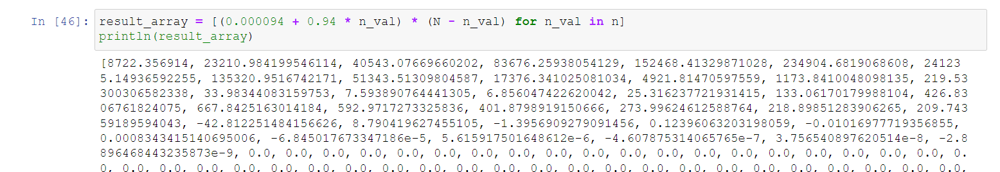

---
## Front matter
lang: ru-RU
title: Лабораторная работа №7
subtitle: Эффективность рекламы
author:
  - Абу Сувейлим Мухаммед Мунивочи
institute:
  - Российский университет дружбы народов, Москва, Россия
date: 22 марта 2024

## i18n babel
babel-lang: russian
babel-otherlangs: english
##mainfont: Arial
##monofont: Courier New
##fontsize: 8pt

## Formatting pdf
toc: false
toc-title: Содержание
slide_level: 2
aspectratio: 169
section-titles: true
theme: metropolis
header-includes:
 - \metroset{progressbar=frametitle,sectionpage=progressbar,numbering=fraction}
 - '\makeatletter'
 - '\beamer@ignorenonframefalse'
 - '\makeatother'
---

# Информация

## Докладчик

::::::::::::::: {.columns align=center}
::: {.column width="70%"}

  * Абу Сувейлим Мухаммед Мунифович
  * студент, НКНбд-01-21
  * Российский университет дружбы народов
  * [103221315@pfur.ru](mailto:103221315@pfur.ru)
:::
::: {.column width="30%"}

:::
::::::::::::::

# Вводная часть

## Актуальность

- Реклама, как известно, является «двигателем торговли» и в настоящее время продвижение продукции на рынок в отсутствие рекламы практически невозможно [1]. Необходимо,
чтобы прибыль будущих продаж (товров или услуг) с избытком покрывала издержки на рекламу. Для этого принимаются математическин модели распространения рекламы. 

## Объект и предмет исследования

- Объектом и предметом исследования является эффективность рекламы как объект и математическая модель распространения рекламы как его прежмет исследования.

## Цели и задачи

- Вариант № 36

1. Целью работы является познокомится с простейшую модель рекламной кампании и проанализировать её.

2. Постройте график распространения рекламы, математическая модель которой описывается
следующим уравнением:
  1. $\frac{dn}{dt} = (0.94+0.000094n(t))(N-n(t))$
  2. $\frac{dn}{dt} = (0.000094+0.94n(t))(N-n(t))$
  3. $\frac{dn}{dt} = (0.94sin(t)+0.94sin(t)n(t))(N-n(t))$

При этом объем аудитории $N = 1040$ , в начальный момент о товаре знает 9 человек. Для случая 2 определите в какой момент времени скорость распространения рекламы будет иметь максимальное значение.

## Материалы и методы

- Астафьева Елена Владимировна, Терпугов Александр Федорович Модель рекламной компании с эффектом «Надоедания» рекламы // Вестн. Том. гос. ун-та. 2004. №284. URL: https://vital.lib.tsu.ru/vital/access/manager/Repository/vtls:000369174 (дата обращения: 22.03.2024).

- Попов В. Д. Д.Н.А. МОДЕЛИРОВАНИЕ РАСПРОСТРАНЕНИЯ РЕКЛАМЫ /
под ред. А Е.А. Белорусский государственный университет информатики
и радиоэлектроники г. Минск, Республика Беларусь; 58-я Научная Конференция Аспирантов, Магистрантов и Студентов БГУИР, 2022. С. 2.

- [Julia Documentation](https://docs.julialang.org/en/v1/). (дата обращения: 16.03.2024)

# Теоретическое введение

## Математическая модель распространения рекламы

- Модель рекламной кампании описывается следующими величинами. Считаем, что $\frac{dn}{dt}$ - корость изменения со временем числа потребителей, узнавших о товаре и готовых его купить $t$ - время, прошедшее с начала рекламной кампании, $n(t)$ - число уже информированных клиентов. Эта величина пропорциональна числу покупателей, еще не знающих о нем, это описывается следующим образом: $\alpha_1(t)(N-n(t))$, где $N$ - общее число потенциальных платежеспособных покупателей, 

## Математическая модель распространения рекламы

$\alpha_1(t) > 0$ - характеризует интенсивность рекламной кампании (зависит от затрат на рекламу в данный момент времени). Помимо этого, узнавшие о товаре потребители также распространяют полученную информацию среди потенциальных покупателей, не знающих о нем (в этом случае работает т.н. сарафанное радио). Этот вклад в рекламу описывается величиной $\alpha_2(t)n(t)(N-n(t))$, эта величина увеличивается с увеличением потребителей узнавших о товаре Математическая модель распространения рекламы описывается уравнением: $\frac{dn}{dt} = (\alpha_1(t)+\alpha_2(t)n(t))(N-n(t))$ (1)

## Математическая модель распространения рекламы

При $\alpha_1(t) \gg \alpha_2(t)$ получается модель типа модели Мальтуса, решение которой имеет вид
{#fig:001 width=70%}

## Математическая модель распространения рекламы


В обратном случае, при $\alpha_1(t) \ll \alpha_2(t)$  получаем уравнение логистической
кривой:
{#fig:002 width=70%}


# Моделирование на Julia

## Реализация на Julia 

```Julia
#начальные значения
a#начальные значения
a2 = 0.94 #коэф,отвечающий за платную рекламу
a1 = 0.000094 #коэф,отвечающий за платную рекламу
N = 1040 #максимальное количество людей, которых может заинтересовать товар
n0 = 9 #количество людей, знающих о товаре в начальный момент времени
```
## Реализация на Julia 

```Julia
#уравнение, описывающее распространение рекламы
function caseTwo(du, u, p, t)
    n = u
    du[1] = (a1 + a2*u[1])*(N - u[1])
end
```
## Реализация на Julia 

```Julia
#интервал временни и начальные значения
tspan = (0, 60)
u0 = [n0]
```

## Реализация на Julia 

```Julia
prob = ODEProblem(caseTwo, u0, tspan)
sol = solve(prob, dtmax = 0.05)
```

## Реализация на Julia 

```Julia
# Находим момент времени, когда скорость распространения рекламы максимальна
max_dndt_ind = argmax([(0.0000094 + 0.94 * n_val) * (N - n_val) for n_val in n])
max_dndt_t = Time[max_dndt_ind]
```

## Реализация на Julia 

```Julia
result_array = [(0.000094 + 0.94 * n_val) * (N - n_val) for n_val in n]
println(result_array)
```
{#fig:001 width=50%}

## Реализация на Julia 

```Julia
sol(0.005319411243810851)
```
{#fig:002 width=50%}

# Результаты 

## $\alpha_1(t) \gg \alpha_2(t)$

- При $\alpha_1(t) \gg \alpha_2(t)$ получается модель типа модели Мальтуса, решение которой имеет вид

{#fig:003 width=50%}

## $\alpha_1(t) \ll \alpha_2(t)$ 

- Получуный график $\alpha_1(t) \ll \alpha_2(t)$ с интервалом времени от 0 до 60.

  {#fig:004 width=50%}


## $\alpha_1(t) \ll \alpha_2(t)$ 

- Получуный график $\alpha_1(t) \ll \alpha_2(t)$ с интервалом времени от 0 до 0.1.

{#fig:005 width=50%}


## $\alpha_1(t) = \alpha_2(t)$

- Получуный график $\alpha_1(t) = \alpha_2(t)$ с интервалом времени от 0 до 0.1.

{#fig:006 width=50%}


## Вывод

- Мы видим, в случаях один и два скорость распространения рекламы быстро растет и потом перестанит меняися.

- Построил модель распространения рекламы