# Цель работы

- Целью работы является познокомится с простейшую модель рекламной кампании и проанализировать её.

# Задание
Вариант № 36

Постройте график распространения рекламы, математическая модель которой описывается
следующим уравнением:
1. $\frac{dn}{dt} = (0.94+0.000094n(t))(N-n(t))$
2. $\frac{dn}{dt} = (0.000094+0.94n(t))(N-n(t))$
3. $\frac{dn}{dt} = (0.94sin(t)+0.94sin(t)n(t))(N-n(t))$

При этом объем аудитории $N = 1040$ , в начальный момент о товаре знает 9 человек. Для случая 2 определите в какой момент времени скорость распространения рекламы будет иметь максимальное значение.

# Теоретическое введение

Модель рекламной кампании описывается следующими величинами. Считаем, что $\frac{dn}{dt}$ - корость изменения со временем числа потребителей, узнавших о товаре и готовых его купить $t$ - время, прошедшее с начала рекламной кампании, $n(t)$ - число уже информированных клиентов. Эта величина пропорциональна числу покупателей, еще не знающих о нем, это описывается следующим образом: $\alpha_1(t)(N-n(t))$, где $N$ - общее число потенциальных платежеспособных покупателей, $\alpha_1(t) > 0$ - характеризует интенсивность рекламной кампании (зависит от затрат на рекламу в данный момент времени). Помимо этого, узнавшие о товаре потребители также распространяют полученную информацию среди потенциальных покупателей, не знающих о нем (в этом случае работает т.н. сарафанное радио). Этот вклад в рекламу описывается величиной $\alpha_2(t)n(t)(N-n(t))$, эта величина увеличивается с увеличением потребителей узнавших о товаре Математическая модель распространения рекламы описывается уравнением: $\frac{dn}{dt} = (\alpha_1(t)+\alpha_2(t)n(t))(N-n(t))$ (1)

При $\alpha_1(t) \gg \alpha_2(t)$ получается модель типа модели Мальтуса, решение которой имеет вид
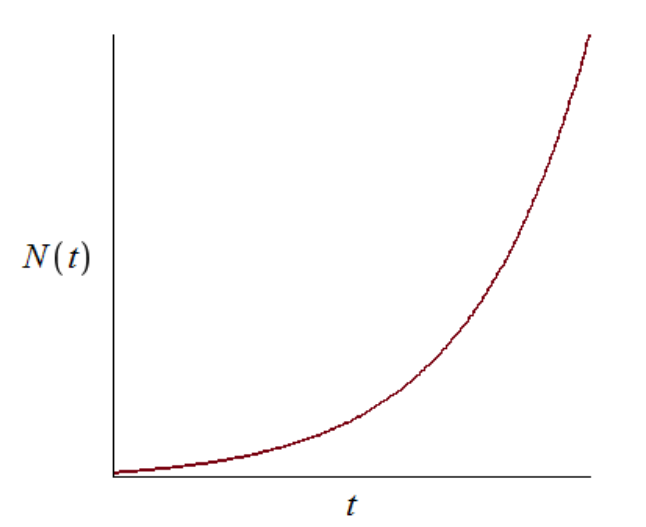{#fig:001 width=70%}

В обратном случае, при $\alpha_1(t) \ll \alpha_2(t)$  получаем уравнение логистической
кривой:
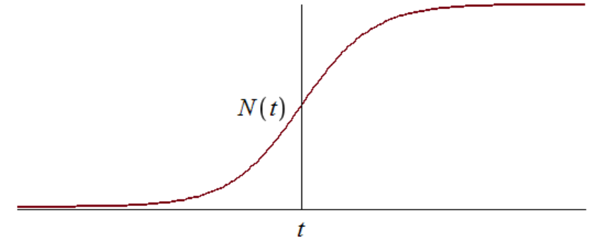{#fig:002 width=70%}

[@Popov]

# Выполнение лабораторной работы

## Моделирование на языке программировании  Julia

### $\alpha_1(t) \gg \alpha_2(t)$ 

1. Во-первых, я использвал пакеты Plots и DifferentialEquations для постпроения графиков и для решения дифференциальных уравнений, соответственно.

   ```Julia
   using Plots
   using DifferentialEquations
   ```

2. Инициализировал нужны нам константи и функции в моделии. $\alpha_1 = 0.94$ - это коэффициент отвечающий за платную рекламу; $\alpha_2 =  0.000094$ - это коэффициент отвечающий за платную рекламу; $N = 1040$  - максимальное количество людей, которых может заинтересовать товар; $n_0 = 9$ - количество людей, знающих о товаре в начальный момент времени;
   ```Julia
   #начальные значения
   a1 = 0.94 #коэф,отвечающий за платную рекламу
   a2 = 0.000094 #коэф,отвечающий за платную рекламу
   N = 1040 #максимальное количество людей, которых может заинтересовать товар
   n0 = 9 #количество людей, знающих о товаре в начальный момент времени
   ```
3. Далее я написал модель распространения рекламы.

   ```Julia
      #уравнение, описывающее распространение рекламы

   function caseOne(du, u, p, t)
      n = u
      du[1] = (a1 + a2*u[1])*(N - u[1])
   end
   ```
4. Далее я обозначал интервал времени.

   ```Julia
   #интервал временни и начальные значения
   #интервал временни и начальные значения
   tspan = (0, 60)
   u0 = [n0]
   ```

5. Здесь я дал аргументы для функции ODEProblem которая указывает на дифф уравнение. Далее, я уравнение решил. Шан времени = $0.05$

   ```Julia
   prob = ODEProblem(caseOne, u0, tspan)
   sol = solve(prob, dtmax = 0.05)
   ```


6. Здесь я переименавал названия переменных.

   ```Julia
   n = [u[1] for u in sol.u]
   Time = [t for t in sol.t]
   ```

7. Далее я подготовил пространство для первого графика.

   ```Julia
   pltOne = plot(dpi = 300, legend = false)
   ```

8. Наконец, я построил график динамики изменения числа людей в каждой из трех групп в случае, когда I(0) <= I*.

   ```Julia
      plot!(
      pltOne,
      Time,
      n,
      title = "График распространения информации о товаре с учетом платной
   рекламы и с учетом сарафанного радио",
      titlefont = font(8),
      xlabel = "Время",
      ylabel = "n(t) - количество людей, знающих о товаре
      в момент времени t",
      guidefontsize=8,
      color=:red  
   ```

9. Получуный график если $\alpha_1(t) \gg \alpha_2(t)$ .

   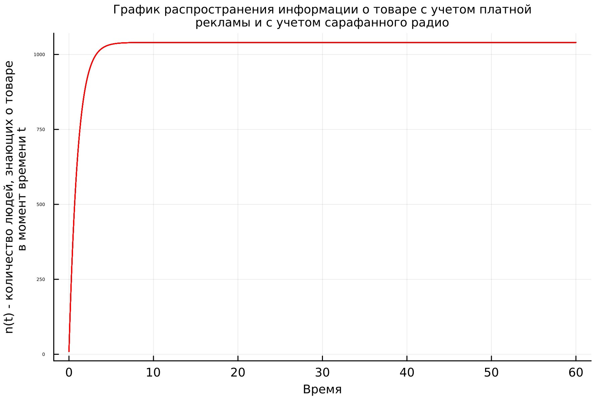{#fig:003 width=70%}


### $\alpha_1(t) \ll \alpha_2(t)$ 

1. Я только исправил коэффициенты в нашей системы. Все остальное как и было.

```Julia
a2 = 0.94 #коэф,отвечающий за платную рекламу
a1 = 0.000094 #коэф,отвечающий за платную рекламу
```
2. Также добавел новую  функцию, чтобы  определить в какой момент времени скорость распространения рекламы будет иметь максимальное значение. $n(0.005319411243810851) = 637.3324449733891$ - максимальная скорость распространения рекламы.

```Julia
# Находим момент времени, когда скорость распространения рекламы максимальна
max_dndt_ind = argmax([(0.0000094 + 0.94 * n_val) * (N - n_val) for n_val in n])
max_dndt_t = Time[max_dndt_ind]
```

3. Получуный график $\alpha_1(t) \ll \alpha_2(t)$ с интервалом времени от 0 до 60.

  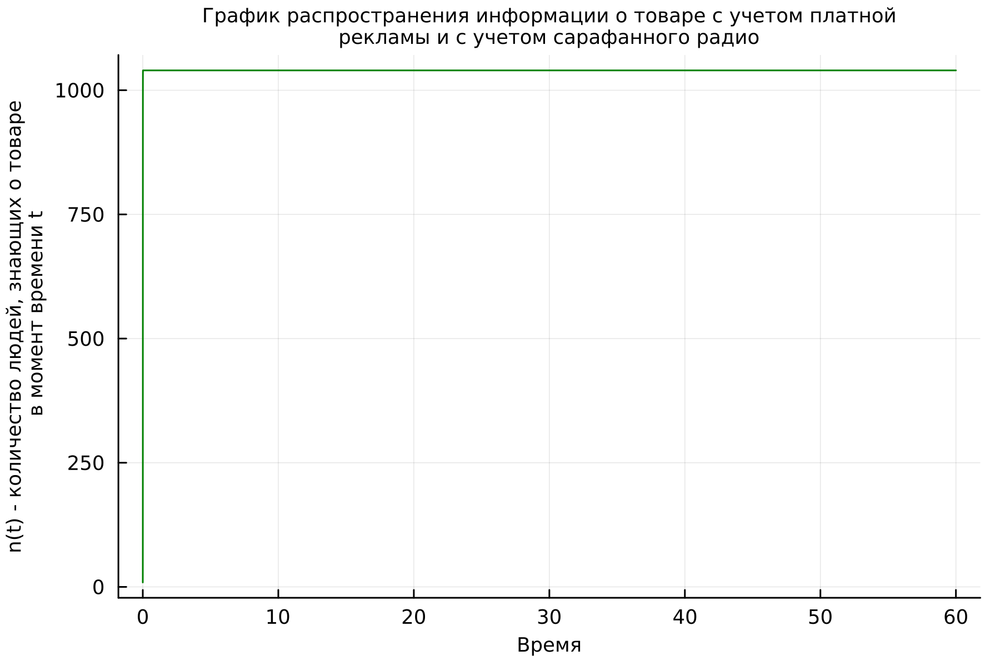{#fig:004 width=70%}

4. Получуный график $\alpha_1(t) \ll \alpha_2(t)$ с интервалом времени от 0 до 0.1.

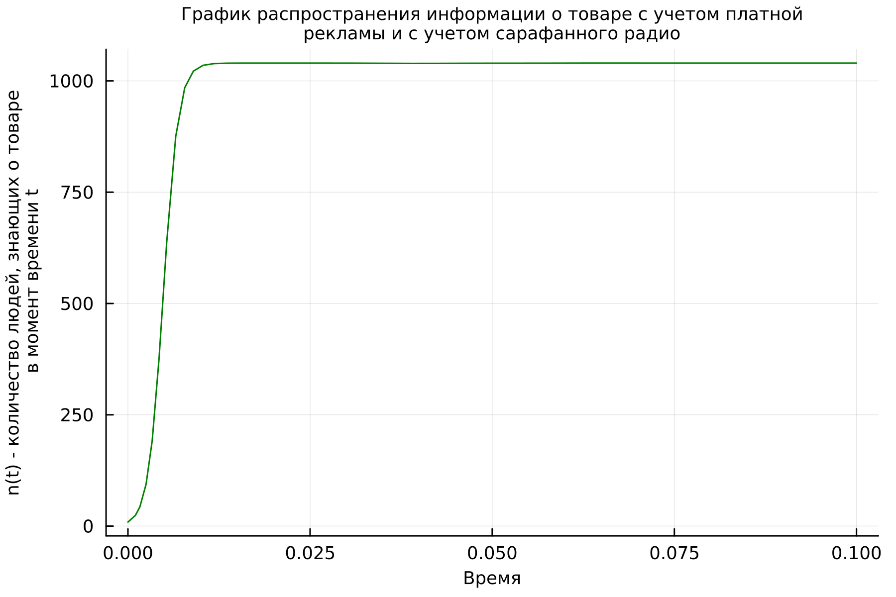{#fig:005 width=70%}

### $\alpha_1(t) = \alpha_2(t)$
1. Я только исправил коэффициенты в нашей системы и добавел sin(t). Все остальное как и было.

```Julia
a2 = 0.94 #коэф,отвечающий за платную рекламу
a1 = 0.94 #коэф,отвечающий за платную рекламу
```
2. Получуный график $\alpha_1(t) = \alpha_2(t)$ с интервалом времени от 0 до 60.

  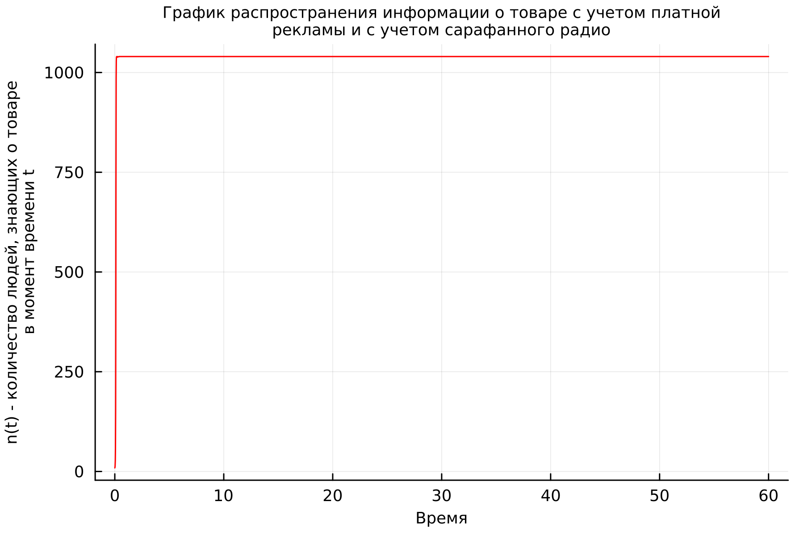{#fig:006 width=70%}

3. Получуный график $\alpha_1(t) = \alpha_2(t)$ с интервалом времени от 0 до 0.1.

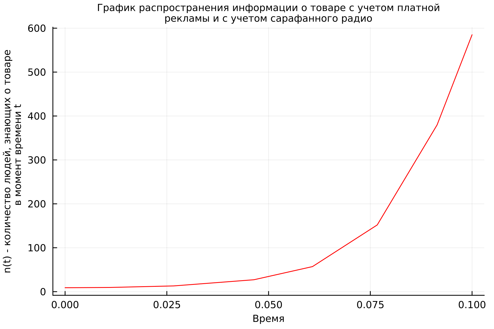{#fig:007 width=70%}

## Моделирование на языке программировании OpenModelica

1. В OpenModelica все прощее. Я просто переписал код из Julia. В этой программе все величины имею тот же смысл, что и в Julia. Переменая t указывает на время.

   ```OpenModelica
   model lab7_1

   Real a1 = 0.94; //коэф,отвечающий за платную рекламу 
   Real a2 = 0.000094; //коэф,отвечающий за платную рекламу
   Real N = 1040; //максимальное количество людей, которых может заинтересовать товар
   Real n;
   Real t = time;

   initial equation

   n = 9;

   equation

   der(n) = (a1 + a2*n)*(N - n);

   end lab7_1;
   ```

2.  $\alpha_1(t) \gg \alpha_2(t)$  в OpenModelica.

   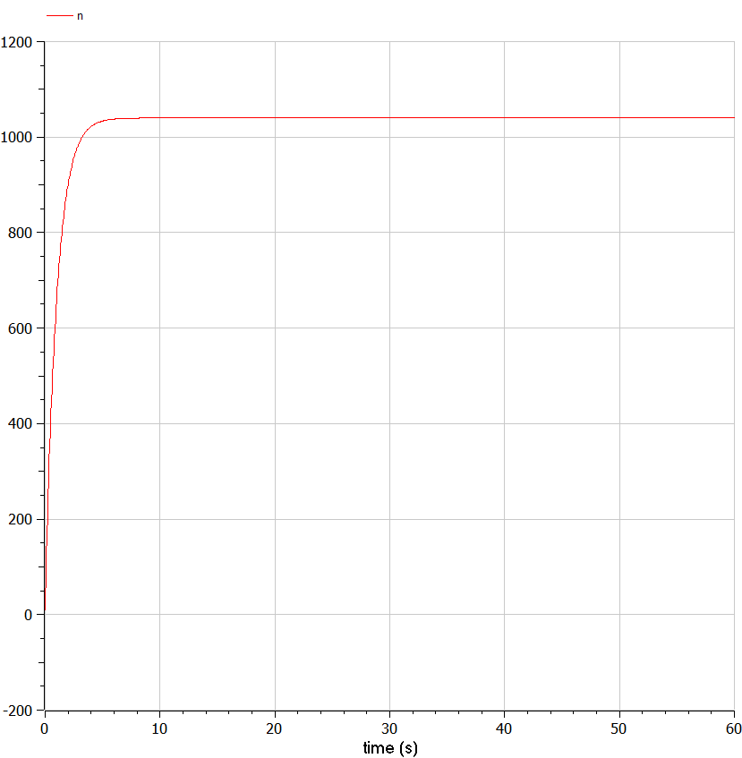{#fig:008 width=70%}

3.  $\alpha_1(t) \ll \alpha_2(t)$  в OpenModelica c интервалом времени от 0 до 60.

  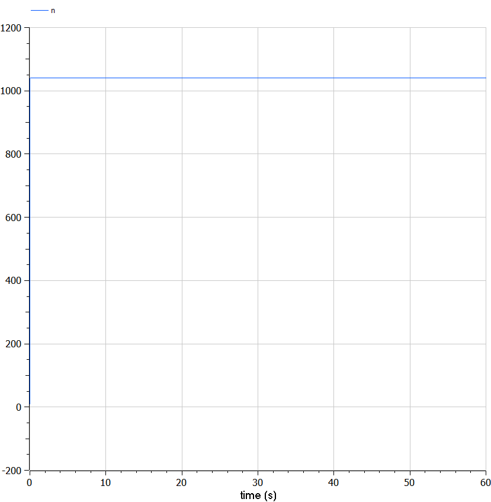{#fig:009 width=70%}

4.  $\alpha_1(t) \ll \alpha_2(t)$  в OpenModelica c интервалом времени от 0 до 0.1.

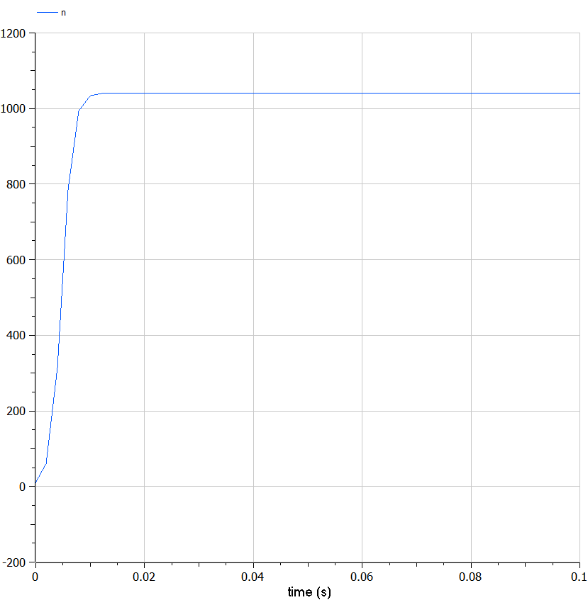{#fig:010 width=70%}

5.  $\alpha_1(t) = \alpha_2(t)$  в OpenModelica c интервалом времени от 0 до 0.1. 

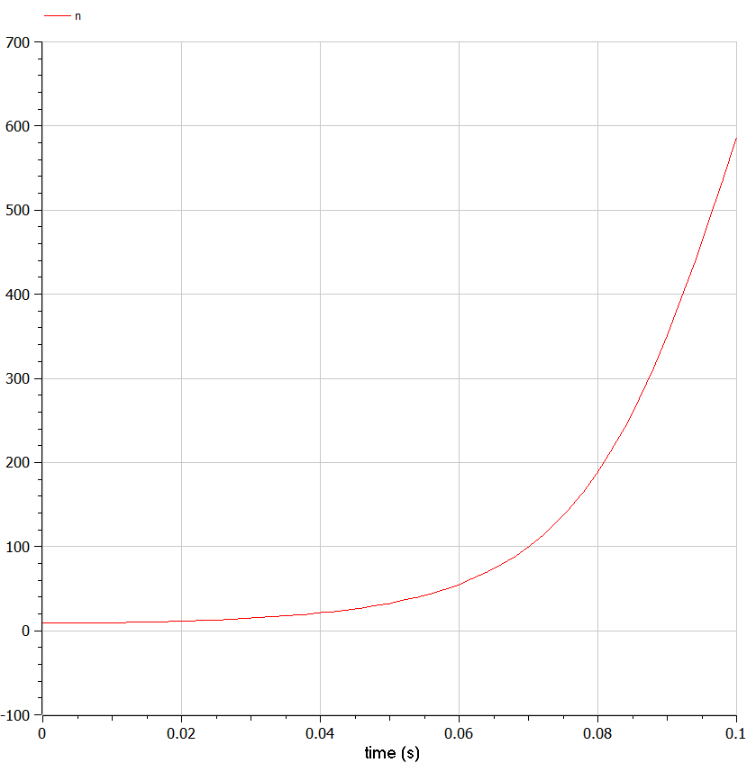{#fig:011 width=70%}

## Исходный код

### Julia

1. $\alpha_1(t) \gg \alpha_2(t)$

``` Julia
using Plots
using DifferentialEquations

#начальные значения
a1 = 0.94 #коэф,отвечающий за платную рекламу
a2 = 0.000094 #коэф,отвечающий за платную рекламу
N = 1040 #максимальное количество людей, которых может заинтересовать товар
n0 = 9 #количество людей, знающих о товаре в начальный момент времени

#уравнение, описывающее распространение рекламы

function caseOne(du, u, p, t)
    n = u
    du[1] = (a1 + a2*u[1])*(N - u[1])
end

#интервал временни и начальные значения
tspan = (0, 60)
u0 = [n0]

prob = ODEProblem(caseOne, u0, tspan)

sol = solve(prob, dtmax = 0.05)

n = [u[1] for u in sol.u]
Time = [t for t in sol.t]

pltOne = plot(dpi = 300, legend = false)

plot!(
    pltOne,
    Time,
    n,
    title = "График распространения информации о товаре с учетом платной
рекламы и с учетом сарафанного радио",
    titlefont = font(8),
    xlabel = "Время",
    ylabel = "n(t) - количество людей, знающих о товаре
    в момент времени t",
    guidefontsize=8,
    color=:red
    )

savefig(pltOne, "C:\\Users\\Mo\\work\\study\\2023-2024\\Математическое моделирование\\mathmod\\study_2023-2024_mathmod\\labs\\lab07\\images\\lab7_1_Julia")
```
[@JuliaDoc]
2. $\alpha_1(t) \ll \alpha_2(t)$ на Julia

``` Julia
using Plots
using DifferentialEquations

#начальные значения
a2 = 0.94 #коэф,отвечающий за платную рекламу
a1 = 0.000094 #коэф,отвечающий за платную рекламу
N = 1040 #максимальное количество людей, которых может заинтересовать товар
n0 = 9 #количество людей, знающих о товаре в начальный момент времени


#уравнение, описывающее распространение рекламы

function caseTwo(du, u, p, t)
    n = u
    du[1] = (a1 + a2*u[1])*(N - u[1])
end


#интервал временни и начальные значения
tspan = (0, 60)
u0 = [n0]


prob = ODEProblem(caseTwo, u0, tspan)

sol = solve(prob, dtmax = 0.05)

n = [u[1] for u in sol.u]
Time = [t for t in sol.t]

pltOne = plot(dpi = 300, legend = false)

plot!(
    pltOne,
    Time,
    n,
    title = "График распространения информации о товаре с учетом платной
рекламы и с учетом сарафанного радио",
    titlefont = font(8),
    xlabel = "Время",
    ylabel = "n(t) - количество людей, знающих о товаре
    в момент времени t",
    guidefontsize=8,
    color=:green
    )

# Находим момент времени, когда скорость распространения рекламы максимальна
max_dndt_ind = argmax([(0.0000094 + 0.94 * n_val) * (N - n_val) for n_val in n])
max_dndt_t = Time[max_dndt_ind]

result_array = [(0.000094 + 0.94 * n_val) * (N - n_val) for n_val in n]
println(result_array)

result_array = [(0.000094 + 0.94 * n_val) * (N - n_val) for n_val in n]
println(result_array)

sol(0.005319411243810851)
```
3. $\alpha_1(t) = \alpha_2(t)$

```Julia
using Plots
using DifferentialEquations

#начальные значения
a1 = 0.94 #коэф,отвечающий за платную рекламу
a2 = 0.94 #коэф,отвечающий за платную рекламу
N = 1040 #максимальное количество людей, которых может заинтересовать товар
n0 = 9 #количество людей, знающих о товаре в начальный момент времени


#уравнение, описывающее распространение рекламы

function caseThree(du, u, p, t)
    n = u
    du[1] = (a1*sin(t) + a2*sin(t)*u[1])*(N - u[1])
end

#интервал временни и начальные значения
tspan = (0, 60)
u0 = [n0]

prob = ODEProblem(caseThree, u0, tspan)

sol = solve(prob, dtmax = 0.05)

n = [u[1] for u in sol.u]
Time = [t for t in sol.t]

pltOne = plot(dpi = 300, legend = false)

plot!(
    pltOne,
    Time,
    n,
    title = "График распространения информации о товаре с учетом платной
рекламы и с учетом сарафанного радио",
    titlefont = font(8),
    xlabel = "Время",
    ylabel = "n(t) - количество людей, знающих о товаре
    в момент времени t",
    guidefontsize=8,
    color=:red
    )

savefig(pltOne, "C:\\Users\\Mo\\work\\study\\2023-2024\\Математическое моделирование\\mathmod\\study_2023-2024_mathmod\\labs\\lab07\\images\\lab7_3_long_Julia")
```

### OpenModelica

1. $\alpha_1(t) \gg \alpha_2(t)$ в OpenModelica

   ``` OpenModelica
   model lab7_1

   Real a1 = 0.94; //коэф,отвечающий за платную рекламу 
   Real a2 = 0.000094; //коэф,отвечающий за платную рекламу
   Real N = 1040; //максимальное количество людей, которых может заинтересовать товар
   Real n;
   Real t = time;

   initial equation

   n = 9;

   equation

   der(n) = (a1 + a2*n)*(N - n);

   end lab7_1;
   ```

2. $\alpha_1(t) \ll \alpha_2(t)$ в OpenModelica

   ``` OpenModelica
   model lab7_2

   Real a2 = 0.94; //коэф,отвечающий за платную рекламу 
   Real a1 = 0.000094; //коэф,отвечающий за платную рекламу
   Real N = 1040; //максимальное количество людей, которых может заинтересовать товар
   Real n;
   Real t = time;

   initial equation

   n = 9;

   equation

   der(n) = (a1 + a2*n)*(N - n);

   end lab7_2;

   ```
3. $\alpha_1(t) = \alpha_2(t)$ в OpenModelica

```OpenModelica
model lab7_3

Real a2 = 0.94; //коэф,отвечающий за платную рекламу 
Real a1 = 0.94; //коэф,отвечающий за платную рекламу
Real N = 1040; //максимальное количество людей, которых может заинтересовать товар
Real n;
Real t = time;

initial equation

n = 9;

equation

der(n) = (a1*sin(t) + a2*sin(t)*n)*(N - n);

end lab7_3;
```

# Вывод

- Мы видим, в случах один и два скорость распространения рекламы быстро растет и потом перестанит меняися.

# Библиография

::: {#refs}
:::