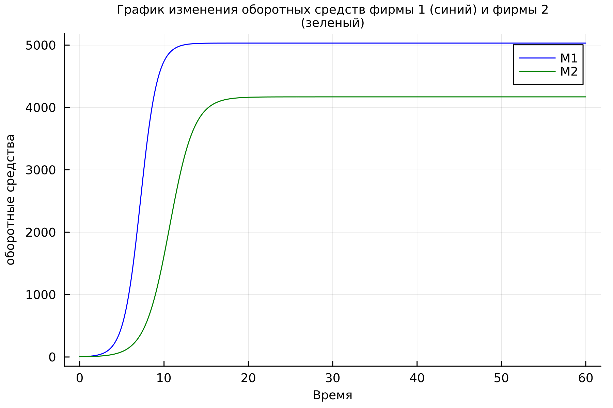
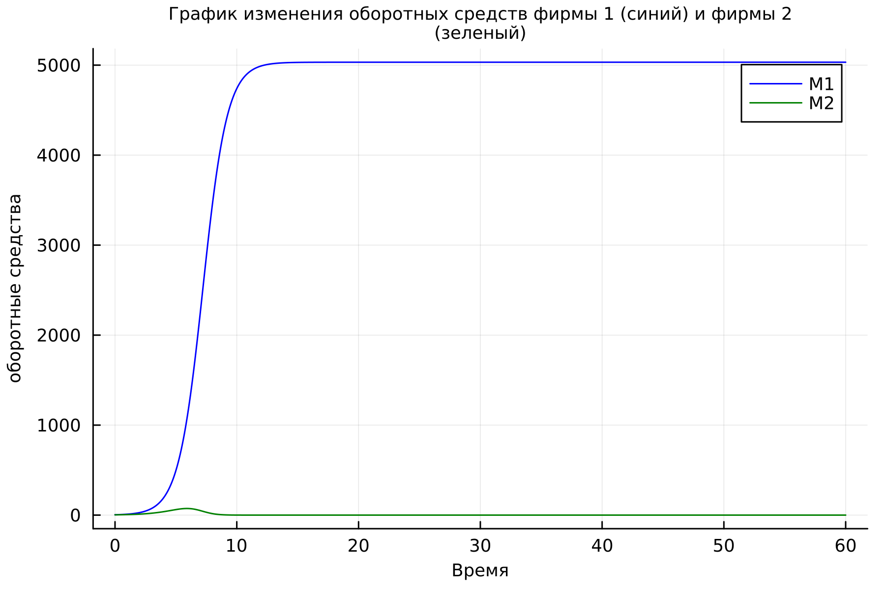
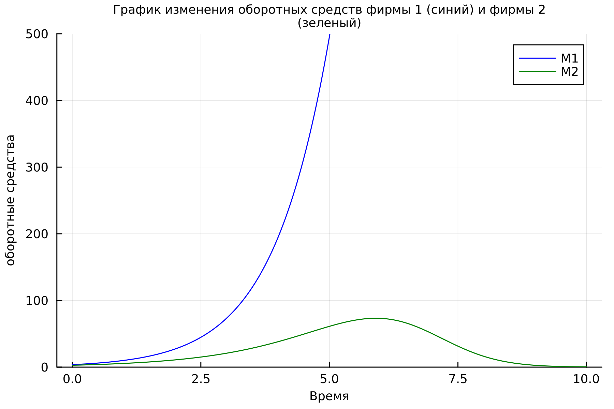
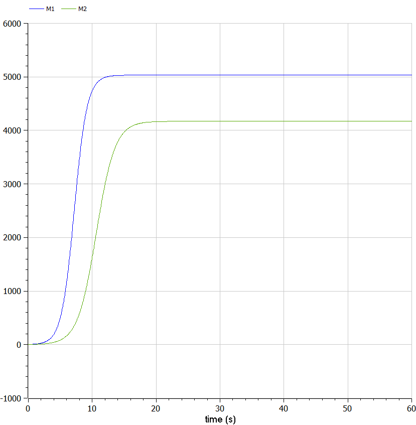
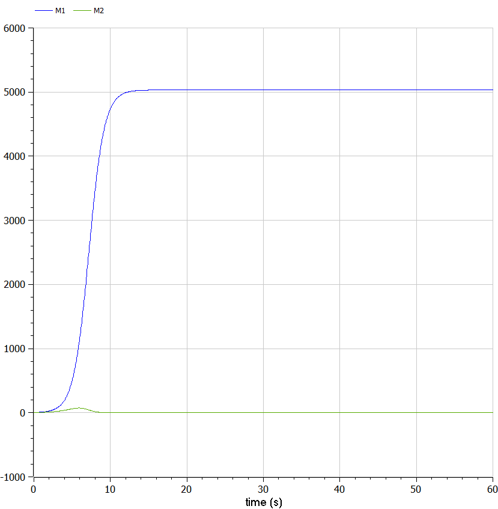

---
## Front matter
lang: ru-RU
title: Лабораторная работа №8
subtitle: Модель конкуренции двух фирм
author:
  - Абу Сувейлим Мухаммед Мунивочи
institute:
  - Российский университет дружбы народов, Москва, Россия
date: 30 марта 2024

## i18n babel
babel-lang: russian
babel-otherlangs: english
##mainfont: Arial
##monofont: Courier New
##fontsize: 8pt

## Formatting pdf
toc: false
toc-title: Содержание
slide_level: 2
aspectratio: 169
section-titles: true
theme: metropolis
header-includes:
 - \metroset{progressbar=frametitle,sectionpage=progressbar,numbering=fraction}
 - '\makeatletter'
 - '\beamer@ignorenonframefalse'
 - '\makeatother'
---

# Информация

## Докладчик

::::::::::::::: {.columns align=center}
::: {.column width="70%"}

  * Абу Сувейлим Мухаммед Мунифович
  * студент, НКНбд-01-21
  * Российский университет дружбы народов
  * [1032215135@pfur.ru](mailto:1032215135@pfur.ru)
:::
::: {.column width="30%"}

:::
::::::::::::::

# Вводная часть

## Актуальность

- "Опыт мирового развития свидетельствует, что в условиях экономики, основанной на знаниях, альтернативы инновационному пути развития нет. Создание, внедрение и широкое распространение новых продуктов, услуг, технологических процессов становятся ключевыми факторами роста объемов производства, занятости, инвестиций, внешнеторгового оборота. Именно здесь кроются наиболее существенные резервы улучшения качества продукции, экономии трудовых и материальных затрат, роста производительности труда, совершенствования организации производства и повышения его эффективности. Все это, в конечном счете, предопределяет конкурентоспособность предприятий и выпускаемой ими продукции на внутреннем и мировом рынках, улучшение социально-экономической ситуации в стране." [1]

## Объект и предмет исследования


- Объектом является модель конкуренции двух фирм. Предметом исследования является взаимодействие и стратегии конкуренции между двумя фирмами в рамках данной модели.

## Цели и задачи

- Вариант № 36

1. Постройте графики изменения оборотных средств фирмы 1 и фирмы 2 без
учета постоянных издержек и с веденной нормировкой для случая 1.

2. Постройте графики изменения оборотных средств фирмы 1 и фирмы 2 без
учета постоянных издержек и с веденной нормировкой для случая 2.

## Цели и задачи

Для обоих случаев рассмотреть задачу со следующими начальными условиями и параметрами:

$$M_0^1=3.7,\ M_0^2=2.8,$$
$$p_{cr}=27,\ N=37,\ q=1,$$
$$\tau_1=27,\ \tau_2=17,$$
$$\widetilde{p}_1=6.7,\ \widetilde{p}_2=11.7$$

*Замечение*: $p_{cr}$, $\widetilde{p}_2$, $N$ указаны в тысячах единиц, а значения $M_{1,2}$ указаны в млн. единиц.

## Материалы и методы

1. Гриценко, Денис Валерьевич Моделирование конкуренции и кооперации фирм в научно-исследовательских разработках: дис. кандидат экономических наук МИМЭ наук: 08.00.13. - Ставрополь, 2010. - 24-25 с. 

2. Bell J.G. // SIAM Review. Society for Industrial; Applied Mathematics, 1990. Т.
32, № 3. С. 487–489.
3. Н. Б.Л. / под ред. Шопенко Д.В. Санкт-Петербург: ИВЭСЭП, 2002. С. –60.
4. Копылов А. В. П.А.Э. // УСПЕХИ СОВРЕМЕННОГО ЕСТЕСТВОЗНАНИЯ. 2003.
№ 8. С. 29–32.
5. Малыхин В.И. Москва: ЛЕНАНД, 2014. С. –216.
6. JuliaHub I. Julia 1.10 Documentation [Электронный ресурс]. 2024. URL: https:
//docs.julialang.org/en/v1/ (дата обращения: 30.03.2024).


# Теоретическое введение

## Случай 1


Рассмотрим две фирмы, производящие взаимозаменяемые товары одинакового качества и находящиеся в одной рыночной нише. Считаем, что в рамках нашей модели конкурентная борьба ведётся только рыночными методами. То есть, конкуренты могут влиять на противника путем изменения параметров своего производства: себестоимость, время цикла, но не могут прямо вмешиваться в ситуацию на рынке («назначать» цену или влиять на потребителей каким-либо инымспособом.) Будем считать, что постоянные издержки пренебрежимо малы, и в модели учитывать не будем. 

## Случай 1


В этом случае динамика изменения объемов продаж фирмы 1 и фирмы 2 описывается следующей системой уравнений:

$$\frac{dM_1}{d\theta} = M_1 - \frac{b}{c_1}M_1 M_2 - \frac{a_1}{c_1} M_1^2 \ (1)$$

$$\frac{dM_2}{d\theta} = \frac{c_2}{c_1} M_2 - \frac{b}{c_1}M_1 M_2 - \frac{a_2}{c_1} M_2^2 \ (2)$$

## Случай 2

Рассмотрим модель, когда, помимо экономического фактора влияния (изменение себестоимости,производственного цикла, использование кредита и т.п.), используются еще и социально-психологические факторы – формирование общественного предпочтения одного товара другому, не зависимо от их качества и цены. В этом случае взаимодействие двух фирм будет зависеть друг от друга, соответственно коэффициент перед $M_1M_2$ будет отличаться. 

## Случай 2

Пусть в рамках рассматриваемой модели динамика изменения объемов продаж фирмы 1 и фирмы 2 описывается следующей системой уравнений:

$$\frac{dM_1}{d\theta} = M_1 - \frac{b}{c_1}M_1 M_2 - \frac{a_1}{c_1} M_1^2 \ (3)$$

$$\frac{dM_2}{d\theta} = \frac{c_2}{c_1} M_2 - (\frac{b}{c_1}+0.0063)M_1 M_2 - \frac{a_2}{c_1} M_2^2 \ (4)$$ 

## Обозначения

*Обозначения*: 

$N$ – число потребителей производимого продукта

$\tau$ – длительность производственного цикла

$p$ – рыночная цена товара

$\widetilde{p}$ – себестоимость продукта, то есть переменные издержки на производство единицы
продукции

$q$ – максимальная потребность одного человека в продукте в единицу времени

$\theta=\dfrac{t}{c_1}$ - безразмерное время

# Моделирование на Julia

## Реализация на Julia 

```Julia
#начальные значения
Mi1 = 3.7 #начальное значение объема оборотных средств M1
Mi2 = 2.8 #начальное значение объема оборотных средств M2
p_cr =  27 #критическая стоимость продукта
N = 37 #число потребителей производимого продукта
q = 1 #максимальная потребность одного человека в продукте в единицу времени
tau1 = 27 #длительность производственного цикла фирмы 1
tau2 = 17 #длительность производственного цикла фирмы 2
p1 = 6.7 #себестоимость продукта у фирмы 1
p2 = 11.7 #себестоимость продукта у фирмы 2
```
## Реализация на Julia 

```Julia
a1 = p_cr/(tau1^2*p1^2*N*q)
a2 = p_cr/(tau2^2*p2^2*N*q)
b = p_cr/(tau1^2*p1^2*tau2^2*p2^2*N*q)
c1 = (p_cr - p1)/(tau1*p1)
c2 = (p_cr - p2)/(tau2*p2)
```

## Реализация на Julia 

```Julia
#уравнение, описывающее распространение рекламы

function caseOne(du, u, p, t)
  M1, M2 = u
  du[1] = u[1] - (b/c1)*u[1]*u[2] - (a1/c1)*u[1]^2
  du[2] = (c2/c1)*u[2] - (b/c1)*u[1]*u[2] - (a2/c1)*u[2]^2
end
```

## Реализация на Julia 

```Julia
#интервал временни и начальные значения
tspan = (0, 60)
u0 = [Mi1, Mi2]
```

## Реализация на Julia 

```Julia
prob = ODEProblem(caseTwo, u0, tspan)
sol = solve(prob, dtmax = 0.05)
```


# Результаты 

## график изменения оборотных средств фирмы 1 (синий) и фирмы 2 (зеленый).

Получуный график изменения оборотных средств фирмы 1 (синий) и фирмы 2 (зеленый). По оси ординат значения $M_1,2 ,$ по оси абсцисс значения $\theta = \frac{t}{c_1}$ (безразмерное время)

   {#fig:001 width=50%}

## график изменения оборотных средств фирмы 1 (синий) и фирмы 2 (зеленый).

Получуный график изменения оборотных средств фирмы 1 (синий) и фирмы 2 (зеленый). По оси ординат значения $M_1,2$ (оборотные средства фирмы 1 и фирмы 2), по оси абсцисс значения $\theta = \frac{t}{c_1}$ (безразмерное время). Иетервал времени от 0 до 60.

{#fig:002 width=50%}

## график изменения оборотных средств фирмы 1 (синий) и фирмы 2 (зеленый).

Получуный график изменения оборотных средств фирмы 1 (синий) и фирмы 2 (зеленый). По оси ординат значения $M_1,2$ (оборотные средства фирмы 1 и фирмы 2), по оси абсцисс значения $\theta = \frac{t}{c_1}$ (безразмерное время). Иетервал времени от 0 до 10 и диапозон у до 500.

{#fig:003 width=50%}

## график изменения оборотных средств фирмы 1 (синий) и фирмы 2 (зеленый).

  {#fig:004 width=50%}

## график изменения оборотных средств фирмы 1 (синий) и фирмы 2 (зеленый).

  {#fig:005 width=70%}


# Вывод

## Вывод

- Построил графики изменения объемов оборотных средств каждой фирмы.
