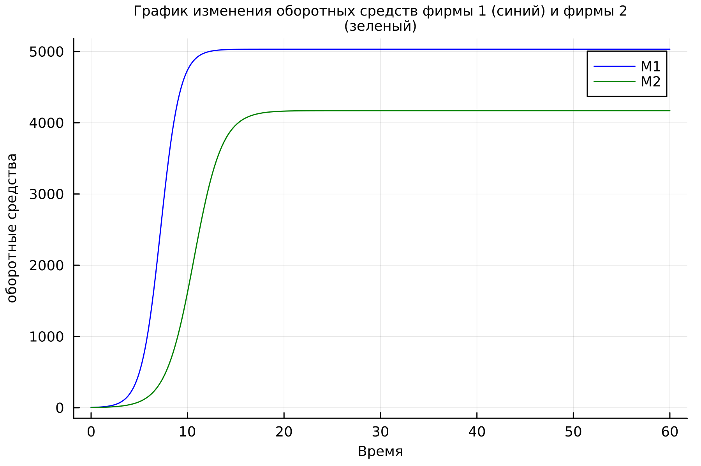
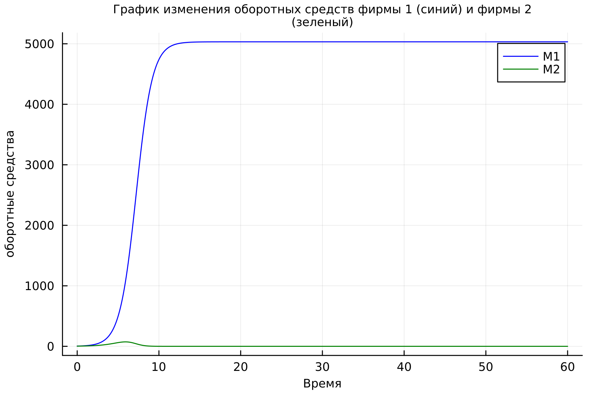
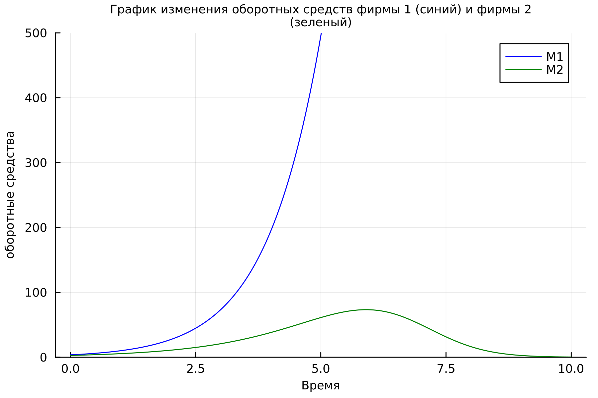
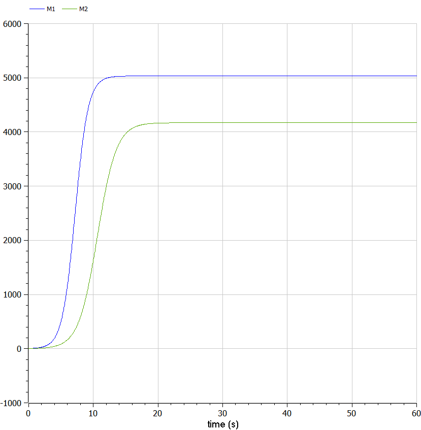
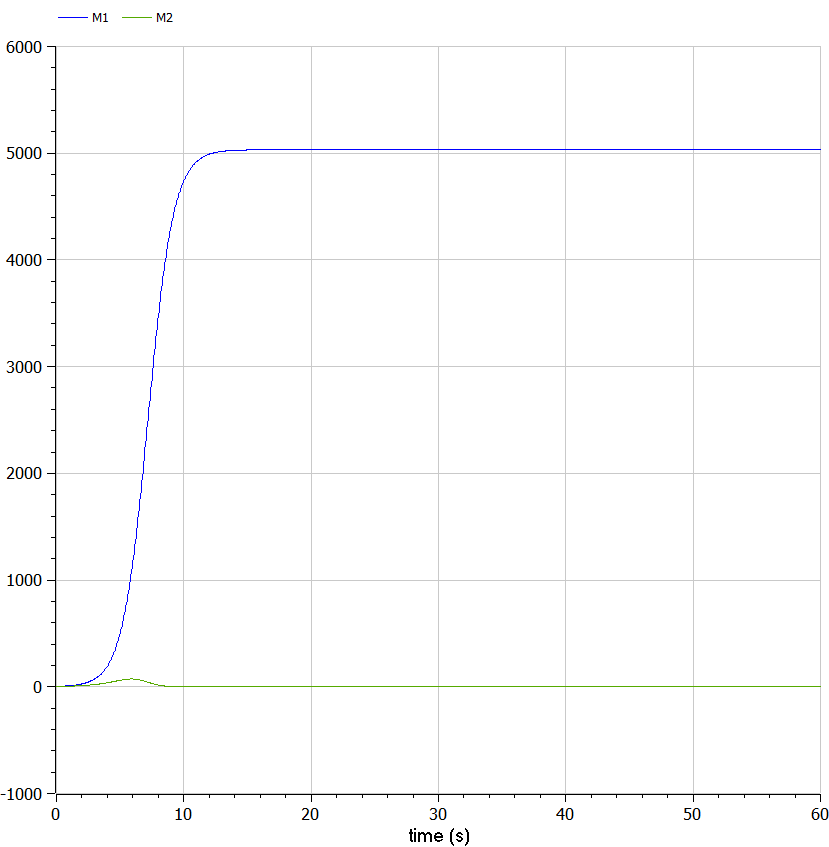

# Цель работы

- Целью работы является познокомится с простейшую модель конкуренции двух фирм (и модель одной фирмы) и проанализировать её.

# Задание
Вариант № 36

## Случай 1
Рассмотрим две фирмы, производящие взаимозаменяемые товары одинакового качества и находящиеся в одной рыночной нише. Считаем, что в рамках нашей модели конкурентная борьба ведётся только рыночными методами. То есть, конкуренты могут влиять на противника путем изменения параметров своего производства: себестоимость, время цикла, но не могут прямо вмешиваться в ситуацию на рынке («назначать» цену или влиять на потребителей каким-либо инымспособом.) Будем считать, что постоянные издержки пренебрежимо малы, и в модели учитывать не будем. В этом случае динамика изменения объемов продаж фирмы 1 и фирмы 2 описывается следующей системой уравнений:


$$\frac{dM_1}{d\theta} = M_1 - \frac{b}{c_1}M_1 M_2 - \frac{a_1}{c_1} M_1^2 \ (1)$$

$$\frac{dM_2}{d\theta} = \frac{c_2}{c_1} M_2 - \frac{b}{c_1}M_1 M_2 - \frac{a_2}{c_1} M_2^2 \ (2)$$

## Случай 2
Рассмотрим модель, когда, помимо экономического фактора влияния (изменение себестоимости,производственного цикла, использование кредита и т.п.), используются еще и социально-психологические факторы – формирование общественного предпочтения одного товара другому, не зависимо от их качества и цены. В этом случае взаимодействие двух фирм будет зависеть друг от друга, соответственно коэффициент перед $M_1M_2$ будет отличаться. Пусть в
рамках рассматриваемой модели динамика изменения объемов продаж фирмы 1 и фирмы 2 описывается следующей системой уравнений:

$$\frac{dM_1}{d\theta} = M_1 - \frac{b}{c_1}M_1 M_2 - \frac{a_1}{c_1} M_1^2 \ (3)$$

$$\frac{dM_2}{d\theta} = \frac{c_2}{c_1} M_2 - (\frac{b}{c_1}+0.0063)M_1 M_2 - \frac{a_2}{c_1} M_2^2 \ (4)$$ 

Для обоих случаев рассмотреть задачу со следующими начальными условиями и параметрами:

$$M_0^1=3.7,\ M_0^2=2.8,$$
$$p_{cr}=27,\ N=37,\ q=1,$$
$$\tau_1=27,\ \tau_2=17,$$
$$\widetilde{p}_1=6.7,\ \widetilde{p}_2=11.7$$

*Замечение*: $p_{cr}$, $\widetilde{p}_2$, $N$ указаны в тысячах единиц, а значения $M_{1,2}$ указаны в млн. единиц.

*Обозначения*: 

$N$ – число потребителей производимого продукта

$\tau$ – длительность производственного цикла

$p$ – рыночная цена товара

$\widetilde{p}$ – себестоимость продукта, то есть переменные издержки на производство единицы
продукции

$q$ – максимальная потребность одного человека в продукте в единицу времени

$\theta=\dfrac{t}{c_1}$ - безразмерное время

1. Постройте графики изменения оборотных средств фирмы 1 и фирмы 2 без
учета постоянных издержек и с веденной нормировкой для случая 1.

2. Постройте графики изменения оборотных средств фирмы 1 и фирмы 2 без
учета постоянных издержек и с веденной нормировкой для случая 2.

# Теоретическое введение

Математическому моделированию процессов конкуренции и сотрудничества двух фирм на различных рынках посвящено довольно много научных работ, в основном использующих аппарат теории игр и статистических решений. В качестве примера можно привести работы таких исследователей, как Курно, Стакельберг, Бертран, Нэш, Парето, основные результаты которых приведены в [@Malykhin2014].

Следует отметить, что динамические дифференциальные модели уже давно и успешно используются для математического моделирования самых разнообразных по своей природе процессов. Достаточно упомянуть широко использующуюся в экологии модель «хищник-жертва» Вольтера [@Murray1990], математическую теорию развития эпидемий, модели боевых действий.В качестве классических примеров дифференциальных моделей экономической динамики отметим модель Эванса установления равновесной цены на рынке одного товара, односекторную модель экономического роста Солоу [@Malykhin2014], однопродуктовые динамические макроэкономические модели Леонтьева [@Berezhnoy2002].

Задача решалась в следующей постановке.

На рынке однородного товара присутствуют две основные фирмы, разделяющие его между собой, т.е. имеет место классическая дуополия.

Безусловно, это является весьма сильным предположением, однако оно вполне оправдано в тех случаях, когда доля продаж остальных конкурентов на рассматриваемом сегменте рынке пренебрежимо мала. Хорошим примером может служить отечественный рынок микропроцессоров, который по существу разделили между собой две фирмы: Intel и AMD. 

Изменение объемов продаж конкурирующих фирм с течением времени описывается  системой дифференциальных уравнений: $(1), (2), (3)  и (4).$ [@Kopylov2003]


# Выполнение лабораторной работы

## Моделирование на языке программировании  Julia

### Случай 1 на языке программировании  Julia

1. Во-первых, я использвал пакеты Plots и DifferentialEquations для постпроения графиков и для решения дифференциальных уравнений, соответственно.

   ```Julia
   using Plots
   using DifferentialEquations
   ```

2. Инициализировал нужны нам константи и функции в моделии. $Mi_1 = 3.7$  - начальное значение объема оборотных средств $M_1$; $Mi_2 = 2.8$  - начальное значение объема оборотных средств $M_2$; $p_cr =  27$ - критическая стоимость продукта; $N = 37$ - число потребителей производимого продукта; $q = 1$ - максимальная потребность одного человека в продукте в единицу времени; $\tau_1 = 27$ - длительность производственного цикла фирмы 1; $\tau_2 = 17$ - длительность производственного цикла фирмы 2; $\widetilde{p}_1 = 6.7$ - себестоимость продукта у фирмы 1; $\widetilde{p}_2 = 11.7$ - себестоимость продукта у фирмы 2; 


   ```Julia
   #начальные значения
   Mi1 = 3.7 #начальное значение объема оборотных средств M1
   Mi2 = 2.8 #начальное значение объема оборотных средств M2
   p_cr =  27 #критическая стоимость продукта
   N = 37 #число потребителей производимого продукта
   q = 1 #максимальная потребность одного человека в продукте в единицу времени
   tau1 = 27 #длительность производственного цикла фирмы 1
   tau2 = 17 #длительность производственного цикла фирмы 2
   p1 = 6.7 #себестоимость продукта у фирмы 1
   p2 = 11.7 #себестоимость продукта у фирмы 2
   a1 = p_cr/(tau1^2*p1^2*N*q)
   a2 = p_cr/(tau2^2*p2^2*N*q)
   b = p_cr/(tau1^2*p1^2*tau2^2*p2^2*N*q)
   c1 = (p_cr - p1)/(tau1*p1)
   c2 = (p_cr - p2)/(tau2*p2)
   ```
3. Далее я написал модель, описывающая динамики оборотных средств двух фирм, производящие взаимозаменяемые товары одинакового качества и находящиеся в одной рыночной нише.

   ```Julia
   #уравнение, описывающее распространение рекламы

   function caseOne(du, u, p, t)
      M1, M2 = u
      du[1] = u[1] - (b/c1)*u[1]*u[2] - (a1/c1)*u[1]^2
      du[2] = (c2/c1)*u[2] - (b/c1)*u[1]*u[2] - (a2/c1)*u[2]^2
   end
   ```
4. Далее я обозначал интервал времени.

   ```Julia
   #интервал временни и начальные значения
   #интервал временни и начальные значения
   tspan = (0, 60)
   u0 = [Mi1, Mi2]
   ```

5. Здесь я дал аргументы для функции ODEProblem которая указывает на дифф уравнение. Далее, я уравнение решил. Шан времени = $0.05$

   ```Julia
   prob = ODEProblem(caseOne, u0, tspan)
   sol = solve(prob, dtmax = 0.05)
   ```


6. Здесь я переименавал названия переменных.

   ```Julia
   M1 = [u[1] for u in sol.u]
   M2 = [u[2] for u in sol.u]
   Time = [t for t in sol.t]
   ```

7. Далее я подготовил пространство для первого графика.

   ```Julia
   pltOne = plot(dpi = 300, legend =:topright)
   ```

8. Наконец, я построил график динамики изменения числа людей в каждой из трех групп в случае, когда I(0) <= I*.

   ```Julia
      plot!(
      pltOne,
      Time,
      M1,
      title = "График изменения оборотных средств фирмы 1 (синий) и фирмы 2
   (зеленый)",
      titlefont = font(8),
      xlabel = "Время",
      ylabel = "оборотные средства",
      guidefontsize=8,
      label = "M1",
      color=:blue
      )
   plot!(
      pltOne,
      Time,
      M2,
      title = "График изменения оборотных средств фирмы 1 (синий) и фирмы 2
   (зеленый)",
      titlefont = font(8),
      xlabel = "Время",
      ylabel = "оборотные средства",
      label = "M2",
      guidefontsize=8,
      color=:green
      )
   ```

9. Получуный график изменения оборотных средств фирмы 1 (синий) и фирмы 2 (зеленый). По оси ординат значения $M_1,2 ,$ по оси абсцисс значения $\theta = \frac{t}{c_1}$ (безразмерное время)

   {#fig:001 width=70%}

По графику видно, что рост оборотных средств предприятий идет независимо друг от друга. В математической модели (17) этот факт отражается в коэффициенте, стоящим перед членом $M_1M_2$: в рассматриваемой задаче он одинаковый в обоих уравнениях $(b/c_1)$. Это было обозначено в условиях задачи. 
Каждая фирма достигает свое максимальное значение объема продаж и остается на рынке с этим значением, то есть каждая фирма захватывает свою часть рынка потребителей, которая не изменяется.


### Случай 2 на языке программировании  Julia

1. Я только изменил коэффициенты в нашей системы. Все остальное как и было.

```Julia
#уравнение, описывающее динамики оборотных средств двух фирм, производящие взаимозаменяемые товары
#одинакового качества и находящиеся в одной рыночной нише 


function caseTwo(du, u, p, t)
    M1, M2 = u
    du[1] = u[1] - (b/c1)*u[1]*u[2] - (a1/c1)*u[1]^2
    du[2] = (c2/c1)*u[2] - (b/c1 + 0.00063)*u[1]*u[2] - (a2/c1)*u[2]^2
end
```

3. Получуный график изменения оборотных средств фирмы 1 (синий) и фирмы 2 (зеленый). По оси ординат значения $M_1,2$ (оборотные средства фирмы 1 и фирмы 2), по оси абсцисс значения $\theta = \frac{t}{c_1}$ (безразмерное время). Иетервал времени от 0 до 60.

  {#fig:002 width=70%}

4. Получуный график изменения оборотных средств фирмы 1 (синий) и фирмы 2 (зеленый). По оси ординат значения $M_1,2$ (оборотные средства фирмы 1 и фирмы 2), по оси абсцисс значения $\theta = \frac{t}{c_1}$ (безразмерное время). Иетервал времени от 0 до 10 и диапозон у до 500.

{#fig:003 width=70%}

По графику видно, что первая фирма, несмотря на начальный рост,
достигнув своего максимального объема продаж, начитает нести убытки и, в итоге,
терпит банкротство. Динамика роста объемов оборотных средств второй фирмы
остается без изменения: достигнув максимального значения, остается на этом
уровне.

## Моделирование на языке программировании OpenModelica

### Случай 1 на языке программировании  Julia

1. В OpenModelica все прощее. Я просто переписал код из Julia. В этой программе все величины имею тот же смысл, что и в Julia. Переменая t указывает на время.

2.  Получуный график изменения оборотных средств фирмы 1 (синий) и фирмы 2 (зеленый). По оси ординат значения $M_1,2 ,$ по оси абсцисс значения $\theta = \frac{t}{c_1}$ (безразмерное время)

    {#fig:004 width=70%}

### Случай 2 на языке программировании  Julia


3.   Получуный график изменения оборотных средств фирмы 1 (синий) и фирмы 2 (зеленый). По оси ординат значения $M_1,2$ (оборотные средства фирмы 1 и фирмы 2), по оси абсцисс значения $\theta = \frac{t}{c_1}$ (безразмерное время). Иетервал времени от 0 до 60.

  {#fig:005 width=70%}

4.  Получуный график изменения оборотных средств фирмы 1 (синий) и фирмы 2 (зеленый). По оси ординат значения $M_1,2$ (оборотные средства фирмы 1 и фирмы 2), по оси абсцисс значения $\theta = \frac{t}{c_1}$ (безразмерное время). Иетервал времени от 0 до 10 и диапозон у до 500.

{#fig:006 width=70%}

## Исходный код

### Julia

1. Случай 1 на Julia

``` Julia
using Plots
using DifferentialEquations

#начальные значения
Mi1 = 3.7 #начальное значение объема оборотных средств M1
Mi2 = 2.8 #начальное значение объема оборотных средств M2
p_cr =  27 #критическая стоимость продукта
N = 37 #число потребителей производимого продукта
q = 1 #максимальная потребность одного человека в продукте в единицу времени
tau1 = 27 #длительность производственного цикла фирмы 1
tau2 = 17 #длительность производственного цикла фирмы 2
p1 = 6.7 #себестоимость продукта у фирмы 1
p2 = 11.7 #себестоимость продукта у фирмы 2

a1 = p_cr/(tau1^2*p1^2*N*q)
a2 = p_cr/(tau2^2*p2^2*N*q)
b = p_cr/(tau1^2*p1^2*tau2^2*p2^2*N*q)
c1 = (p_cr - p1)/(tau1*p1)
c2 = (p_cr - p2)/(tau2*p2)

#уравнение, описывающее динамики оборотных средств двух фирм, производящие взаимозаменяемые товары
#одинакового качества и находящиеся в одной рыночной нише 


function caseOne(du, u, p, t)
    M1, M2 = u
    du[1] = u[1] - (b/c1)*u[1]*u[2] - (a1/c1)*u[1]^2
    du[2] = (c2/c1)*u[2] - (b/c1)*u[1]*u[2] - (a2/c1)*u[2]^2
end

#интервал временни и начальные значения
tspan = (0, 60)
u0 = [Mi1, Mi2]

prob = ODEProblem(caseOne, u0, tspan)

sol = solve(prob, dtmax = 0.05)

M1 = [u[1] for u in sol.u]
M2 = [u[2] for u in sol.u]
Time = [t for t in sol.t]

pltOne = plot(dpi = 300, legend =:topright)

plot!(
    pltOne,
    Time,
    M1,
    title = "График изменения оборотных средств фирмы 1 (синий) и фирмы 2
(зеленый)",
    titlefont = font(8),
    xlabel = "Время",
    ylabel = "оборотные средства",
    guidefontsize=8,
    label = "M1",
    color=:blue
    )
plot!(
    pltOne,
    Time,
    M2,
    title = "График изменения оборотных средств фирмы 1 (синий) и фирмы 2
(зеленый)",
    titlefont = font(8),
    xlabel = "Время",
    ylabel = "оборотные средства",
    label = "M2",
    guidefontsize=8,
    color=:green
    )

savefig(pltOne, "C:\\Users\\Mo\\work\\study\\2023-2024\\Математическое моделирование\\mathmod\\study_2023-2024_mathmod\\labs\\lab08\\report\\images\\lab8_1_Julia")
```
[@JuliaDoc]


2. Случай 2 на Julia

``` Julia
using Plots
using DifferentialEquations

#начальные значения
Mi1 = 3.7 #начальное значение объема оборотных средств M1
Mi2 = 2.8 #начальное значение объема оборотных средств M2
p_cr =  27 #критическая стоимость продукта
N = 37 #число потребителей производимого продукта
q = 1 #максимальная потребность одного человека в продукте в единицу времени
tau1 = 27 #длительность производственного цикла фирмы 1
tau2 = 17 #длительность производственного цикла фирмы 2
p1 = 6.7 #себестоимость продукта у фирмы 1
p2 = 11.7 #себестоимость продукта у фирмы 2

a1 = p_cr/(tau1^2*p1^2*N*q)
a2 = p_cr/(tau2^2*p2^2*N*q)
b = p_cr/(tau1^2*p1^2*tau2^2*p2^2*N*q)
c1 = (p_cr - p1)/(tau1*p1)
c2 = (p_cr - p2)/(tau2*p2)

#уравнение, описывающее динамики оборотных средств двух фирм, производящие взаимозаменяемые товары
#одинакового качества и находящиеся в одной рыночной нише 


function caseTwo(du, u, p, t)
    M1, M2 = u
    du[1] = u[1] - (b/c1)*u[1]*u[2] - (a1/c1)*u[1]^2
    du[2] = (c2/c1)*u[2] - (b/c1 + 0.00063)*u[1]*u[2] - (a2/c1)*u[2]^2
end

#интервал временни и начальные значения
tspan = (0, 10)
u0 = [Mi1, Mi2]

prob = ODEProblem(caseTwo, u0, tspan)

sol = solve(prob, dtmax = 0.05)

M1 = [u[1] for u in sol.u]
M2 = [u[2] for u in sol.u]
Time = [t for t in sol.t]

pltOne = plot(dpi = 300, legend =:topright, ylims=(0,500))

plot!(
    pltOne,
    Time,
    M1,
    title = "График изменения оборотных средств фирмы 1 (синий) и фирмы 2
(зеленый)",
    titlefont = font(8),
    xlabel = "Время",
    ylabel = "оборотные средства",
    guidefontsize=8,
    label = "M1",
    color=:blue
    )
plot!(
    pltOne,
    Time,
    M2,
    title = "График изменения оборотных средств фирмы 1 (синий) и фирмы 2
(зеленый)",
    titlefont = font(8),
    xlabel = "Время",
    ylabel = "оборотные средства",
    label = "M2",
    guidefontsize=8,
    color=:green
    )

savefig(pltOne, "C:\\Users\\Mo\\work\\study\\2023-2024\\Математическое моделирование\\mathmod\\study_2023-2024_mathmod\\labs\\lab08\\report\\images\\lab8_2_short_Julia")
```

### OpenModelica

1. Случай 1 на OpenModelica

   ``` OpenModelica
   model lab8_1

   //начальные значения

   Real p_cr = 27; //критическая стоимость продукта
   Real N = 37; //число потребителей производимого продукта
   Real q = 1; //максимальная потребность одного человека в продукте в единицу времени
   Real tau1 = 27; //длительность производственного цикла фирмы 1
   Real tau2 = 17; //длительность производственного цикла фирмы 2
   Real p1 = 6.7; //себестоимость продукта у фирмы 1
   Real p2 = 11.7; //себестоимость продукта у фирмы 2
   Real M1;
   Real M2;

   Real a1 = p_cr/(tau1^2*p1^2*N*q);
   Real a2 = p_cr/(tau2^2*p2^2*N*q);
   Real b = p_cr/(tau1^2*p1^2*tau2^2*p2^2*N*q);
   Real c1 = (p_cr - p1)/(tau1*p1);
   Real c2 = (p_cr - p2)/(tau2*p2);

   Real t = time;

   initial equation

   M1 = 3.7;
   M2 = 2.8;

   equation

   der(M1) = M1 - (b/c1)*M1*M2 - (a1/c1)*M1^2;
   der(M2) = (c2/c1)*M2 - (b/c1)*M1*M2 - (a2/c1)*M2^2;


   end lab8_1;
   ```

2. Случай 2 на OpenModelica

   ``` OpenModelica
   model lab8_2

   //начальные значения

   Real p_cr = 27; //критическая стоимость продукта
   Real N = 37; //число потребителей производимого продукта
   Real q = 1; //максимальная потребность одного человека в продукте в единицу времени
   Real tau1 = 27; //длительность производственного цикла фирмы 1
   Real tau2 = 17; //длительность производственного цикла фирмы 2
   Real p1 = 6.7; //себестоимость продукта у фирмы 1
   Real p2 = 11.7; //себестоимость продукта у фирмы 2
   Real M1;
   Real M2;

   Real a1 = p_cr/(tau1^2*p1^2*N*q);
   Real a2 = p_cr/(tau2^2*p2^2*N*q);
   Real b = p_cr/(tau1^2*p1^2*tau2^2*p2^2*N*q);
   Real c1 = (p_cr - p1)/(tau1*p1);
   Real c2 = (p_cr - p2)/(tau2*p2);

   Real t = time;

   initial equation

   M1 = 3.7;
   M2 = 2.8;

   equation

   der(M1) = M1 - (b/c1)*M1*M2 - (a1/c1)*M1^2;
   der(M2) = (c2/c1)*M2 - (b/c1 + 0.00063)*M1*M2 - (a2/c1)*M2^2;


   end lab8_2;
   ```

# Вывод

- Построил графики изменения объемов оборотных средств каждой фирмы.

# Библиография

::: {#refs}
:::